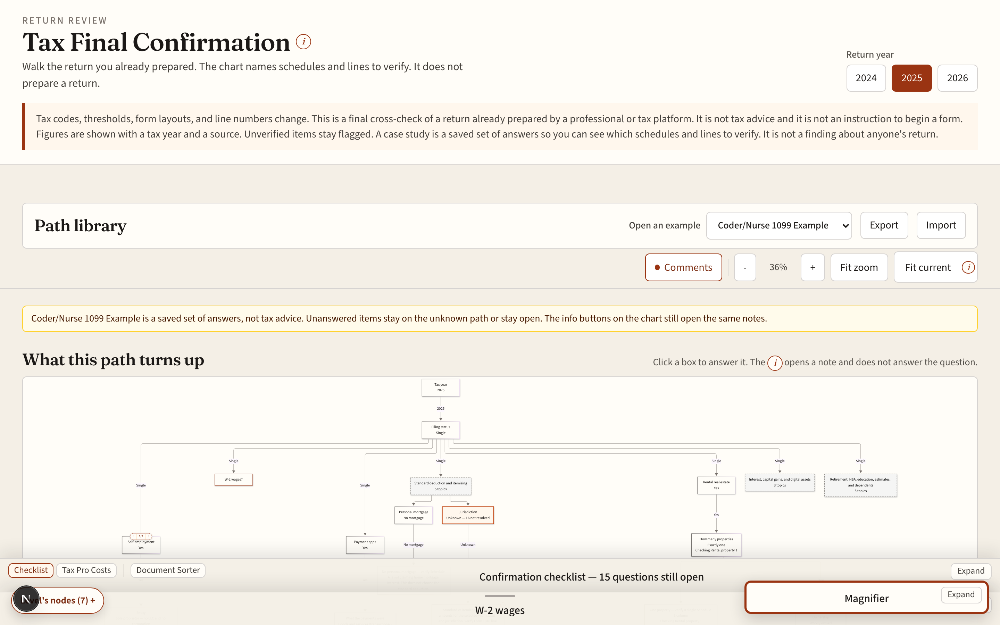
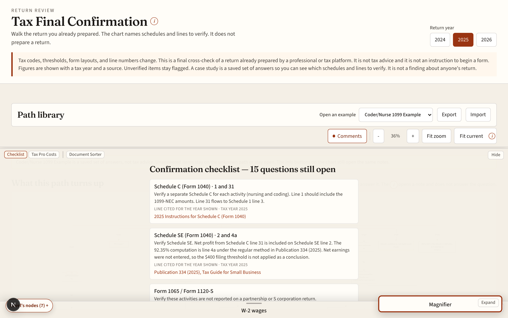
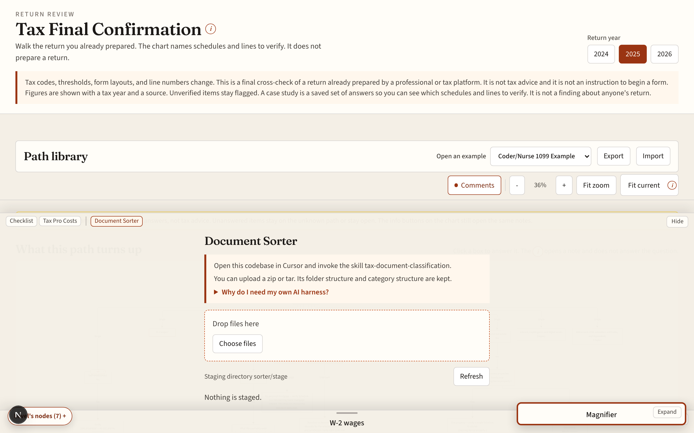
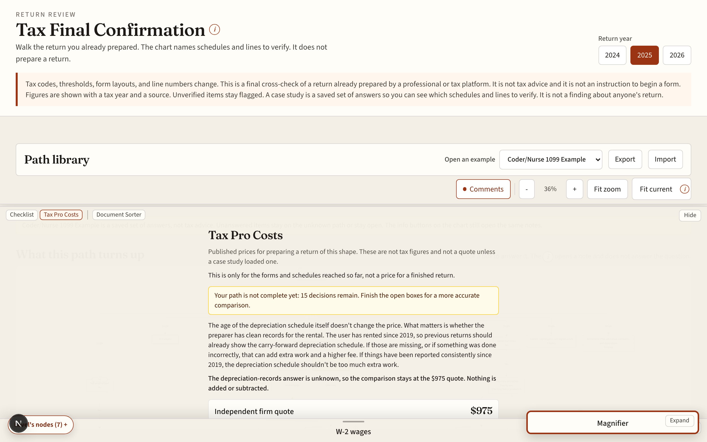

# Tax Final Confirmation

A final cross-check for a return already prepared by a professional or tax platform. The chart asks what is on that return and names the forms, schedules, and lines to verify. It does not prepare a return and it does not tell you to start a form.

Tax codes, thresholds, form layouts, and line numbers change. This is a final cross-check of a return already prepared by a professional or tax platform. It is not tax advice and it is not an instruction to begin a form. Figures are shown with a tax year and a source. Unverified items stay flagged. A case study is a saved set of answers so you can see which schedules and lines to verify. It is not a finding about anyone's return.

The decision graph, the on-screen chart, and the checklist all come from `src/lib/graph`. Read [docs/DECISION_GRAPH.md](docs/DECISION_GRAPH.md) for the full branching design, the sourced deduction amounts, the 2025 Form 1099-K threshold, and the preparation-price comparison.





## Run it

```bash
npm install
npm run dev
```

Then open http://127.0.0.1:43123

Start blank, or open a case study. **Coder/Nurse 1099 Example** walks a single filer with two 1099-NEC activities, payment-app goods and services, and one paid-off rental. Louisiana versus Los Angeles, the payment-app amount, and whether the depreciation records are clean stay unknown. **Joint W-2 & Crypto Example** is a second, shorter path so the tool is not only that example. Case-study facts are not tax advice.

`npm test` checks the graph. `npm run generate-graph` rewrites the decision-graph document from the same source.

## Sort documents with the AI skill

Before you walk the chart, you can drop W-2s, 1099s, receipts, bills, and scans into the **Document Sorter** tab (or into `sorter/stage/`). An AI skill, `tax-document-classification`, then sorts them into folders such as Income - Self-employment, Income - Rental, Deductions, and _Last year's return, and it renames generic filenames so each pile is easier to think about and to match against the schedules the chart names.



Open this repo in Cursor and invoke `tax-document-classification` (optionally with a folder and `--tax-year`). Files stay on the machine. The skill lives at [`.agents/skills/tax-document-classification/SKILL.md`](.agents/skills/tax-document-classification/SKILL.md).

The same tab can also place files into those categories by hand after upload.


