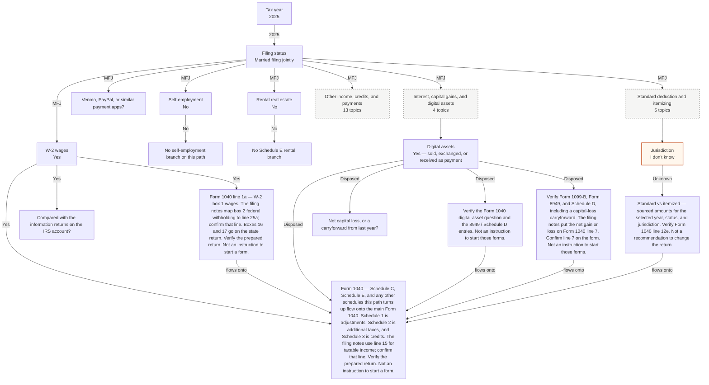

# Decision graph

Tax codes, thresholds, form layouts, and line numbers change. This is a final cross-check of a return already prepared by a professional or tax platform. It is not tax advice and it is not an instruction to begin a form. Figures are shown with a tax year and a source. Unverified items stay flagged. A case study is a saved set of answers so you can see which schedules and lines to verify. It is not a finding about anyone's return.

This document and the interactive chart are generated from the same node list. A blank session answers only the tax year (2025, the return someone would still be final-checking in early October 2026). Case studies are optional saved paths.

## How a session walks

1. Start at the tax year.
2. An answer reveals only the nodes named on that answer.
3. Check nodes have no question. They name a form, schedule, or line to verify, with a short explanation.
4. Every question has an unknown answer. Unknown does not borrow a yes.
5. `flowsTo` draws a "flows onto" line when both nodes are already revealed. Schedule C and Schedule E use that line into Form 1040.
6. The checklist and the cost comparison read the revealed nodes. Uncertain lines stay flagged. Prices that were not on a retrieved page stay flagged.

## Full graph

```mermaid
flowchart TD
  year["Tax year being final-checked"]
  filing_status["Filing status on the return"]
  w2["W-2 wages?"]
  check_w2["Form 1040 line 1a — W-2 box 1 wages. The filing notes map box 2 federal withholding to line 25a; confirm that line. Boxes 16 and 17 go on the state return. Verify the prepared return. Not an instruction to start a form."]
  note_w2_no["No W-2 wages on this path"]
  flag_w2["W-2 wages unknown — verify whether line 1a was considered"]
  info_returns["Compared with the information returns on the IRS account?"]
  check_info_returns["Information returns compared. Verify each statement on the IRS account (W-2, 1099-NEC, 1099-K, 1099-INT, 1099-DIV, 1099-B, 1099-G, 1095-A) is on the return in the exact amount shown. Not an instruction to add income."]
  flag_info_returns["Information returns not compared — verify the IRS account's Returned Documents page against the return"]
  prior_return["Is last year's return available to compare?"]
  check_prior_return["Compare this return's forms with last year's list. Verify the carryforwards: the Schedule D capital-loss carryforward, the Schedule E depreciation schedule, and a prior-year overpayment applied on Form 1040 line 26. A form that dropped off is a question to ask, not a finding."]
  flag_prior_return["Last year's return not available — the form list and the carryforwards stay unverified"]
  se["Self-employment or 1099-NEC income?"]
  note_se_no["No self-employment branch on this path"]
  flag_se["Self-employment unknown — verify whether Schedule C was considered"]
  se_entity["Is the work a sole proprietorship or an entity?"]
  se_count["How many sole-proprietor activities?"]
  se_names["Name the sole-proprietor activities"]
  schedule_c["Schedule C is for self-employment income and expenses, including 1099-NEC freelance jobs.<br/>Verify on the prepared return. Not an instruction to start a form."]
  schedule_se["Schedule SE — self-employment tax on sole-proprietor net profit. Half of that tax is Schedule 1 line 15. The filing notes place the tax on Schedule 2 and call the Social Security wage-base cap line 7; confirm both. Verify it. The i button outlines the calculation. Not a tax computation."]
  check_no_entity["Verify the work is not reported on Form 1065 or Form 1120-S"]
  check_entity_k1["Entity path — verify Schedule E Part II or the K-1. Do not treat Schedule C as the entity return."]
  se_screen["Form 8995, or a work-from-home share on Schedule C?"]
  check_se_both["Verify Form 8995 or Form 8995-A. The filing notes deduct 20% of qualified business income, subject to limits, on line 5. Also verify Schedule C line 25 for the work share of utilities. Confirm both lines. This chart does not compute either amount."]
  note_qbi_no["Neither Form 8995 nor a Schedule C line 25 work-from-home share is on this activity. Verify that was intentional. This chart does not compute either amount."]
  check_8995["Verify Form 8995 or Form 8995-A. The filing notes deduct 20% of qualified business income, subject to limits, on line 5. Confirm that line. Schedule C line 25 is not opened from this answer. The 2024 income cutoffs in the notes are not applied."]
  flag_qbi["Qualified business income and Schedule C line 25 are unknown — neither Form 8995 nor a work-from-home share is assumed"]
  check_home_c["Verify Schedule C line 25 for the work share of utilities (electric, phone, internet, water, and similar). A home-office share of insurance, taxes, or mortgage is a separate proportion of the space used for work. Form 8995 is not opened from this answer. This chart does not compute either share."]
  se_records["Vehicle, meals, or home-office expenses on this Schedule C?"]
  check_se_records["Verify the mileage log, the meal records (who, what, why), and exclusive-and-regular use of any home office behind the Schedule C expense lines. Those line numbers are not named in the filing notes, so they stay flagged. Not an instruction to add an expense."]
  note_se_records_no["No vehicle, meal, or home-office deduction on this Schedule C"]
  flag_se_records["Vehicle, meal, and home-office deductions unknown — verify the Schedule C expense lines and the logs behind them"]
  se_workers["Did this business pay any worker USD 600 or more?"]
  check_se_workers["Verify that each worker paid USD 600 or more received a W-2 or a 1099-NEC, that a Form W-9 is on file for each contractor, and that the Schedule C questions about Forms 1099 were answered. The Schedule C line letters are not named in the filing notes, so they stay flagged."]
  note_se_workers_no["No worker was paid USD 600 or more by this business"]
  flag_se_workers["Payments to workers unknown — verify whether a W-2 or 1099-NEC had to be issued"]
  se_loss["Does this Schedule C show a loss on line 31?"]
  check_hobby["Schedule C line 31 is a loss. Verify the profit-motive facts the filing notes use (profit in 3 of 5 years) and whether Form 5213 was filed for a new activity. Line 31 still flows to Schedule 1 line 3. This chart does not decide hobby versus business."]
  note_se_profit["Schedule C shows a profit on this path. The hobby-loss rule is not opened."]
  flag_se_loss["Whether Schedule C line 31 is a loss is unknown — the hobby-loss rule and Form 5213 are not assumed"]
  se_de_minimis["Items under USD 2,500 each expensed under the de minimis safe harbor?"]
  check_de_minimis["Verify the de minimis safe harbor election statement is attached, naming the taxpayer, the Schedule C or E it covers, the tax year, and the USD 2,500 per-item limit (USD 5,000 only with audited financials and a written policy). Not an instruction to expense or capitalize anything."]
  note_de_minimis_no["No de minimis safe harbor election on this path"]
  flag_de_minimis["Whether small purchases were expensed under the de minimis safe harbor is unknown — the statement is not assumed"]
  se_resale["Box 2 checked on a 1099-NEC (direct sales for resale)?"]
  check_resale["1099-NEC box 2 is checked. Verify that resale income and any inventory cost on this Schedule C match the products received. The notes say the IRS watches resale relationships for unreported sales and inventory write-offs. Not an instruction to change the return."]
  note_resale_no["No 1099-NEC box 2 on this path"]
  flag_resale["1099-NEC box 2 unknown — read the statement before assuming no resale relationship"]
  payapps["Venmo, PayPal, or similar payment apps?"]
  note_pay_no["No payment-app branch"]
  flag_pay["Payment-app activity unknown — no 1099-K rule applied"]
  pay_class["Personal transfers or goods and services?"]
  check_personal["Personal transfers — verify they were not reported as business income"]
  pay_1099k["Did a platform issue Form 1099-K?"]
  check_1099k_form["Form 1099-K was issued — verify that form on the prepared return"]
  pay_amount["Amount and transaction count"]
  check_manual["Goods-and-services income is still reportable when the platform does not issue Form 1099-K. Verify the manual entry. Not an instruction to start a form."]
  rental["Rental real estate on the return?"]
  note_rental_no["No Schedule E rental branch"]
  flag_rental["Rental activity unknown — verify whether Schedule E Part I was considered"]
  rental_count["How many rental properties?"]
  check_one_property["One property — verify a single Schedule E column, with line 1a address and line 1b type code"]
  rental_own["Who owns the rental?"]
  check_whole["Wholly owned — verify it is not a Form 1065 rental"]
  rental_debt["Is the rental mortgaged?"]
  check_paid_off["Paid-off rental — verify Schedule E line 12 mortgage interest"]
  rental_participation["Day-to-day rental work, or passive?"]
  check_rental_passive["Passive rental stays on Schedule E. Do not treat Form 8995 as applying, and do not move this rental onto Schedule C. A signed 250-hour safe-harbor statement would not match this answer."]
  check_rental_active["Active rental: verify Form 8995 or Form 8995-A. The filing notes use Schedule E line 3 (rents), line 18 (depreciation), and line 21 (net income). Confirm line 21 on the form. The 20% figure is line 5 on the QBI form in the notes; confirm that line."]
  rental_safe_harbor["250-hour rental QBI safe-harbor statement?"]
  check_safe_harbor["Verify the signed statement: the property was not a residence, books are separate, 250 hours are logged, it is not a triple-net lease, and no home-office deduction was taken for this property. This chart does not decide that the hours were met."]
  check_qbi_no_harbor["No safe-harbor statement on this path. If Form 8995 or Form 8995-A is claimed, the filing notes say to be ready to show material participation. Do not create the 250-hour statement from this chart."]
  flag_rental_qbi["Whether the rental is passive or active is unknown. Form 8995 is not assumed, and a safe-harbor statement is not assumed."]
  rental_history["When did the rental start, and was it on an earlier return?"]
  check_history["Rental was on earlier returns — verify those returns agree. Do not set a depreciation start year from this alone."]
  schedule_e["Schedule E is where rental property income and expenses go: rent collected, repairs (including a permit for a repair), insurance, depreciation, and rental fees such as Los Angeles RSO and SCEP. Verify it on the prepared return. Not an instruction to start a form."]
  rental_tenant["Did a tenant pay water or other expenses?"]
  note_tenant_no["No tenant-paid expenses on this path"]
  flag_tenant["Tenant-paid water or other expenses unknown — verify line 3 and line 17"]
  tenant_how["How did the return treat tenant-paid expenses?"]
  check_tenant["Verify tenant-paid amounts against Schedule E line 3 and the expense lines"]
  rental_alloc["Any owner use, or square-footage split?"]
  sqft_docs["Is the square-footage split documented?"]
  check_sqft["Square footage is or is not documented. The line 16 factor comes from the numbers entered, not from this box."]
  check_alloc["Verify Schedule E line 2 fair-rental and personal-use days"]
  flag_alloc["Owner/tenant allocation unknown — verify line 2 and any square-footage worksheet"]
  alloc_sqft["Rental square feet and whole-property square feet"]
  check_sqft_factor["Suggest a square-footage factor for Schedule E line 16 (taxes) from the numbers entered."]
  alloc_occupants["People in the rental units and everyone on the property"]
  check_water_factor["Suggest an occupant factor for Schedule E line 17 (utilities) from the numbers entered."]
  rental_fees["Los Angeles RSO and SCEP fees"]
  note_rental_fees_no["No Los Angeles RSO or SCEP fee on this path"]
  flag_rental_fees["RSO and SCEP fees unknown — verify Schedule E line 19"]
  check_rental_fees["Suggest verifying Los Angeles RSO and SCEP fees on Schedule E line 19."]
  rental_repairs["Rental repairs, and a permit cost if there was one"]
  note_repairs_none["No rental repairs on this path"]
  flag_repairs["Repairs and permit costs unknown — verify Schedule E line 14"]
  check_repairs["Suggest verifying repairs, and any permit for that repair, on Schedule E line 14."]
  rental_insurance["Property insurance premium"]
  note_insurance_none["No property insurance premium on this path"]
  flag_insurance["Insurance premium unknown — verify Schedule E line 9"]
  check_insurance["Suggest verifying the insurance premium on Schedule E line 9, using the square-footage factor when the owner lives on the property."]
  rental_depr["Does this return claim depreciation?"]
  check_depr["Verify Schedule E line 18 and whether Form 4562 is attached for a 2025 reason. The filing notes' basis is the building or improvement assessed value in the year the rental started, times the rental portion, over 27.5 years."]
  flag_depr["Whether depreciation was claimed is unknown — verify line 18"]
  rental_records["Do prior returns show a clean carry-forward depreciation schedule?"]
  check_records_clean["Carry-forward looks consistent — verify the worksheet matches the prior year. Not a fee change."]
  check_records_problem["Carry-forward missing or inconsistent — verify the worksheet. If depreciation was never taken in earlier years, the filing notes name Form 3115 to catch up. Extra preparation work is possible. No dollar amount is added."]
  flag_records["Carry-forward cleanliness is unknown. Do not assume the schedule started in 2019. No fee is changed."]
  interest["Interest or dividends, including tax-exempt interest?"]
  note_interest_no["No interest or dividend branch"]
  interest_threshold["Over USD 1,500 of taxable interest or ordinary dividends?"]
  check_sch_b["Schedule B — verify Forms 1099-INT and 1099-DIV. Tax-exempt interest is Form 1040 line 2a. On the 2025 form, taxable interest is line 2b and ordinary dividends are line 3b. Confirm those lines if the year is different."]
  check_interest_small["Not over USD 1,500 — Schedule B may still be required for another listed reason"]
  flag_interest["Interest or dividends unknown — Schedule B flagged, not assumed"]
  capgain["Sales of stocks, funds, or other capital assets?"]
  note_capgain_no["No Schedule D sales branch"]
  check_capgain["Verify Form 1099-B, Form 8949, and Schedule D, including a capital-loss carryforward. The filing notes put the net gain or loss on Form 1040 line 7. Confirm line 7 on the form. Not an instruction to start those forms."]
  flag_capgain["Capital-asset sales unknown — verify whether Form 8949 was considered"]
  capgain_loss["Net capital loss, or a carryforward from last year?"]
  check_capital_loss["Verify Schedule D Part III, the Capital Loss Carryforward Worksheet, and Form 1040 line 7. The filing notes cap the loss against other income at USD 3,000 a year (USD 1,500 married filing separately); confirm those figures for the year. The carryforward comes from last year's return. Not a tax computation."]
  note_capital_loss_no["No net capital loss and no carryforward on this path"]
  flag_capital_loss["Net loss or carryforward unknown — verify Schedule D Part III and last year's carryforward"]
  crypto["Crypto or other digital assets?"]
  note_crypto_no["No digital-asset branch"]
  check_crypto["Verify the Form 1040 digital-asset question and the 8949 / Schedule D entries. Not an instruction to start those forms."]
  check_crypto_held["Verify the digital-asset question was answered. Holding alone does not open Form 8949 from this path."]
  flag_crypto["Digital assets unknown — verify the Form 1040 question"]
  foreign["Foreign financial accounts or foreign income?"]
  check_foreign["Verify the Schedule B foreign-account question, FinCEN Form 114 if the accounts exceeded USD 10,000 in total, and Form 8938 if foreign assets exceeded USD 50,000. The dollar figures are from the filing notes; confirm them. Not an instruction to start those forms."]
  check_foreign_income["Foreign income is on this path. The filing notes' FreeTaxUSA walkthrough handles it on a Misc screen and does not name the form, so the form stays flagged. Verify the prepared return reports it."]
  note_foreign_no["No foreign-account or foreign-income branch"]
  flag_foreign["Foreign accounts or income unknown — FinCEN Form 114, Form 8938, and the Schedule B question are not assumed"]
  retirement["IRA or pension distributions (Form 1099-R)?"]
  note_retire_no["No Form 1099-R branch"]
  check_retire["Verify Form 1099-R against the IRA and pension lines. Those line numbers are flagged — read them on the form."]
  flag_retire["Retirement distributions unknown — verify whether a 1099-R was considered"]
  hsa["Health savings account (Form 8889)?"]
  note_hsa_no["No Form 8889 branch"]
  check_hsa["Verify Form 8889. Contribution limits are not stored here, so no cap is shown."]
  flag_hsa["HSA unknown — verify whether Form 8889 was considered"]
  education["Education credit or student loan interest?"]
  note_edu_no["No education branch"]
  check_edu["Verify Form 1098-T and Form 8863 for an education credit. American Opportunity and Lifetime Learning cannot both be claimed for the same student. Student loan interest is an adjustment on Schedule 1. The filing notes place credits on Schedule 3. Line numbers are flagged."]
  flag_edu["Education items unknown — verify Form 1098-T, Form 8863, and student loan interest"]
  estimates["Estimated tax payments?"]
  note_est_no["No estimated-tax branch"]
  check_est["Verify estimated tax payments on Form 1040 line 26, which the filing notes label estimated tax payments and amount applied from prior year return. The 2025 Schedule E instructions also refer to line 26 for an estimated-tax credit."]
  flag_est["Estimated payments unknown — verify the payments section"]
  dependents["Dependents on the return?"]
  note_dep_no["No dependent-credit branch"]
  check_dependents["Verify the dependents section and Schedule 8812 if a child tax credit is on the return. Qualifying children for the earned income credit use Schedule EIC, which has its own question. Line numbers are flagged."]
  flag_dep["Dependents unknown — verify the dependents section"]
  dependent_care["Dependent care credit?"]
  note_care_no["No dependent care credit on this path"]
  check_care["Verify the dependent care credit. The filing notes place it on Schedule 3. The form number is not named in the notes, so it stays flagged."]
  flag_care["Dependent care credit unknown — Schedule 3 is not assumed"]
  unemployment["Unemployment or paid family leave (Form 1099-G)?"]
  note_unemp_no["No Form 1099-G branch"]
  check_1099g["Verify Form 1099-G box 1 (unemployment compensation) and box 4 if federal tax was withheld. The Form 1040 line is not named in the filing notes, so it stays flagged."]
  flag_unemp["Form 1099-G unknown — unemployment income is not assumed"]
  marketplace["Marketplace health insurance (Form 1095-A)?"]
  note_market_no["No Form 1095-A branch"]
  check_8962["Verify Form 1095-A and Form 8962. The filing notes place the net premium tax credit on Schedule 3. This chart does not compute the credit."]
  flag_market["Form 1095-A unknown — Form 8962 is not assumed"]
  eitc["Earned income credit?"]
  note_eitc_no["No earned income credit on this path"]
  check_eitc_kids["Verify the earned income credit and Schedule EIC. The filing notes place the credit on Form 1040 line 27. Confirm that line. Income limits in the notes are not applied."]
  check_eitc["Verify the earned income credit on Form 1040. The filing notes place it on line 27. Confirm that line. Schedule EIC is not opened from a no-child answer."]
  flag_eitc["Earned income credit unknown — line 27 and Schedule EIC are not assumed"]
  amt["Form 6251 (alternative minimum tax)?"]
  note_amt_no["No Form 6251 on this path. This answer does not compute alternative minimum tax."]
  check_6251["Verify Form 6251. Exemption amounts are not stored here, so no cap is shown."]
  flag_amt["Form 6251 unknown — alternative minimum tax is not assumed"]
  underpay["Form 2210 underpayment penalty?"]
  note_2210_no["No Form 2210 on this path"]
  check_2210["Verify Form 2210 against the answer you gave. The filing notes describe an underpayment penalty when withholding and estimates did not cover the year. This chart does not compute the penalty."]
  flag_2210["Form 2210 unknown — an underpayment penalty is not assumed"]
  installment["Installment agreement (Form 9465)?"]
  note_9465_no["No Form 9465 on this path"]
  check_9465["Verify Form 9465. The filing notes use it to request an installment agreement. This chart does not compute a payment."]
  flag_9465["Form 9465 unknown — an installment agreement is not assumed"]
  extension["Filing extension (Form 4868)?"]
  note_4868_no["No filing extension on this path"]
  check_4868["Verify Form 4868. It extends time to file, not time to pay. The filing notes put the extended file-by date at October 15."]
  flag_4868["Form 4868 unknown — an extension is not assumed"]
  ip_pin["IRS Identity Protection PIN (IP PIN)?"]
  check_ip_pin["Verify the current-year six-digit IP PIN is entered on the e-filed return for each person who has one. Last year's PIN does not carry over. The Form 1040 entry spot is not named in the filing notes, so it stays flagged. A California PIN is separate."]
  note_ip_pin_no["No Identity Protection PIN on this path"]
  flag_ip_pin["Identity Protection PIN unknown — verify whether the IRS issued one before e-filing"]
  personal_mortgage["Personal mortgage on a home you live in?"]
  check_no_mortgage["No personal mortgage — verify Schedule A is not claiming home mortgage interest. This does not choose the standard deduction."]
  check_mortgage["If the return itemizes, verify Form 1098 and home mortgage interest on Schedule A. Not a reason to start Schedule A."]
  age_blind["Age 65 or older, or blind, at year end?"]
  claimed_dependent["Can someone else claim you?"]
  mfs_spouse["Does the spouse itemize on a separate return?"]
  deduction_choice["What the prepared return deducted"]
  itemized_amount["Schedule A total already on the return"]
  check_sch_a["Itemized on Schedule A: verify Form 1098 for home mortgage interest, the state-and-local-tax cap on line 5e, charitable gifts with receipts from registered 501(c)(3)s, and Form 8283 for noncash donations over USD 500. The Schedule A total is the Form 1040 line 12e figure. Not a recommendation to itemize."]
  jurisdiction["Which state return is being checked? Only California is supported for now."]
  ca_itemized["California itemized total on the prepared Form 540, if any"]
  check_ca_health["California kept a state health-coverage rule after the federal penalty ended. Verify the state return's coverage questions, including Covered California if a Form 1095-A is in the file. This chart does not compute a penalty."]
  ca_renter["Rented a home in California during the year?"]
  check_ca_renter["Verify the California renter's credit on Form 540, and that the return says the rented property was not exempt from property tax. The Form 540 line is not named in the filing notes, so it stays flagged. This chart does not compute the credit."]
  note_ca_renter_no["No California renter's credit on this path"]
  flag_ca_renter["Whether a California home was rented is unknown — the renter's credit is not assumed"]
  deduction_result["Standard vs itemized — sourced amounts for the selected year, status, and jurisdiction. Verify Form 1040 line 12e. Not a recommendation to change the return."]
  flag_deduction["A deduction fact is unknown — do not treat a comparison as finished"]
  form_1040["Form 1040 — Schedule C, Schedule E, and any other schedules this path turns up flow onto the main Form 1040. Schedule 1 is adjustments, Schedule 2 is additional taxes, and Schedule 3 is credits. The filing notes use line 15 for taxable income; confirm that line. Verify the prepared return. Not an instruction to start a form."]
  year -->|"2024"| filing_status
  filing_status -->|"Single"| w2
  filing_status -->|"Single"| se
  filing_status -->|"Single"| payapps
  filing_status -->|"Single"| rental
  filing_status -->|"Single"| interest
  filing_status -->|"Single"| capgain
  filing_status -->|"Single"| crypto
  filing_status -->|"Single"| foreign
  filing_status -->|"Single"| retirement
  filing_status -->|"Single"| hsa
  filing_status -->|"Single"| education
  filing_status -->|"Single"| estimates
  filing_status -->|"Single"| dependents
  filing_status -->|"Single"| unemployment
  filing_status -->|"Single"| marketplace
  filing_status -->|"Single"| eitc
  filing_status -->|"Single"| amt
  filing_status -->|"Single"| underpay
  filing_status -->|"Single"| installment
  filing_status -->|"Single"| extension
  filing_status -->|"Single"| ip_pin
  filing_status -->|"Single"| personal_mortgage
  filing_status -->|"Single"| age_blind
  filing_status -->|"Single"| claimed_dependent
  filing_status -->|"Single"| deduction_choice
  filing_status -->|"Single"| jurisdiction
  filing_status -->|"MFS"| mfs_spouse
  w2 -->|"Yes"| check_w2
  w2 -->|"Yes"| info_returns
  w2 -->|"Yes"| form_1040
  w2 -->|"No"| note_w2_no
  w2 -->|"Unknown"| flag_w2
  check_w2 -->|"flows onto"| form_1040
  info_returns -->|"Compared"| check_info_returns
  info_returns -->|"Compared"| prior_return
  info_returns -->|"Not compared"| flag_info_returns
  prior_return -->|"Compared"| check_prior_return
  prior_return -->|"Not available"| flag_prior_return
  se -->|"Yes"| se_entity
  se -->|"No"| note_se_no
  se -->|"Unknown"| flag_se
  se_entity -->|"Sole prop"| se_count
  se_entity -->|"Partnership"| check_entity_k1
  se_entity -->|"Unknown"| flag_se
  se_count -->|"One"| se_names
  se_count -->|"Unknown"| schedule_c
  se_count -->|"Unknown"| schedule_se
  se_count -->|"Unknown"| se_screen
  se_count -->|"Unknown"| flag_se
  se_count -->|"Unknown"| form_1040
  se_names -->|"Unknown"| schedule_c
  se_names -->|"Unknown"| schedule_se
  se_names -->|"Unknown"| se_screen
  se_names -->|"Unknown"| flag_se
  se_names -->|"Unknown"| form_1040
  se_names -->|"Named"| check_no_entity
  schedule_c -->|"flows onto"| form_1040
  schedule_se -->|"flows onto"| form_1040
  check_entity_k1 -->|"flows onto"| form_1040
  se_screen -->|"Both"| check_se_both
  se_screen -->|"Both"| se_records
  se_screen -->|"QBI only"| check_8995
  se_screen -->|"Home only"| check_home_c
  se_screen -->|"Neither"| note_qbi_no
  se_screen -->|"Unknown"| flag_qbi
  check_se_both -->|"flows onto"| form_1040
  check_8995 -->|"flows onto"| form_1040
  se_records -->|"Yes"| check_se_records
  se_records -->|"Yes"| se_workers
  se_records -->|"No"| note_se_records_no
  se_records -->|"Unknown"| flag_se_records
  se_workers -->|"Yes"| check_se_workers
  se_workers -->|"Yes"| se_loss
  se_workers -->|"No"| note_se_workers_no
  se_workers -->|"Unknown"| flag_se_workers
  se_loss -->|"Loss"| check_hobby
  se_loss -->|"Loss"| se_de_minimis
  se_loss -->|"Profit"| note_se_profit
  se_loss -->|"Unknown"| flag_se_loss
  se_de_minimis -->|"Yes"| check_de_minimis
  se_de_minimis -->|"Yes"| se_resale
  se_de_minimis -->|"No"| note_de_minimis_no
  se_de_minimis -->|"Unknown"| flag_de_minimis
  se_resale -->|"Box 2 checked"| check_resale
  se_resale -->|"Not checked"| note_resale_no
  se_resale -->|"Unknown"| flag_resale
  payapps -->|"Yes"| pay_class
  payapps -->|"No"| note_pay_no
  payapps -->|"Unknown"| flag_pay
  pay_class -->|"Personal"| check_personal
  pay_class -->|"Goods and services"| pay_1099k
  pay_class -->|"Unknown"| flag_pay
  pay_1099k -->|"Form issued"| check_1099k_form
  pay_1099k -->|"Form issued"| form_1040
  pay_1099k -->|"No form"| pay_amount
  check_1099k_form -->|"flows onto"| form_1040
  pay_amount -->|"Unknown"| check_manual
  pay_amount -->|"Unknown"| form_1040
  check_manual -->|"flows onto"| form_1040
  rental -->|"Yes"| rental_count
  rental -->|"No"| note_rental_no
  rental -->|"Unknown"| flag_rental
  rental_count -->|"One"| check_one_property
  rental_count -->|"One"| rental_own
  rental_count -->|"Unknown"| flag_rental
  rental_own -->|"Wholly owned"| check_whole
  rental_own -->|"Wholly owned"| rental_debt
  rental_own -->|"Wholly owned"| rental_participation
  rental_own -->|"Entity"| check_entity_k1
  rental_own -->|"Unknown"| flag_rental
  rental_debt -->|"Paid off"| check_paid_off
  rental_debt -->|"Paid off"| rental_history
  rental_participation -->|"Active"| check_rental_active
  rental_participation -->|"Active"| rental_safe_harbor
  rental_participation -->|"Passive"| check_rental_passive
  rental_participation -->|"Unknown"| flag_rental_qbi
  check_rental_active -->|"flows onto"| form_1040
  rental_safe_harbor -->|"Statement attached"| check_safe_harbor
  rental_safe_harbor -->|"No statement"| check_qbi_no_harbor
  rental_safe_harbor -->|"Unknown"| flag_rental_qbi
  rental_history -->|"Since 2019"| check_history
  rental_history -->|"Since 2019"| schedule_e
  rental_history -->|"Since 2019"| rental_tenant
  rental_history -->|"Since 2019"| rental_alloc
  rental_history -->|"Since 2019"| rental_depr
  rental_history -->|"Since 2019"| rental_records
  rental_history -->|"Since 2019"| form_1040
  rental_history -->|"Unknown"| flag_rental
  rental_history -->|"Unknown"| rental_fees
  schedule_e -->|"flows onto"| form_1040
  rental_tenant -->|"Yes"| tenant_how
  rental_tenant -->|"No"| note_tenant_no
  rental_tenant -->|"Unknown"| flag_tenant
  tenant_how -->|"Both sides"| check_tenant
  rental_alloc -->|"All rented"| check_alloc
  rental_alloc -->|"All rented"| rental_fees
  rental_alloc -->|"Shared property"| sqft_docs
  rental_alloc -->|"Shared property"| alloc_sqft
  rental_alloc -->|"Shared property"| alloc_occupants
  rental_alloc -->|"Unknown"| flag_alloc
  sqft_docs -->|"Documented"| check_sqft
  alloc_sqft -->|"Unknown"| flag_alloc
  alloc_sqft -->|"Square feet"| check_sqft_factor
  alloc_occupants -->|"Unknown"| flag_alloc
  alloc_occupants -->|"Occupants"| check_water_factor
  rental_fees -->|"None"| note_rental_fees_no
  rental_fees -->|"None"| rental_repairs
  rental_fees -->|"Unknown"| flag_rental_fees
  rental_fees -->|"Fees entered"| check_rental_fees
  rental_repairs -->|"None"| note_repairs_none
  rental_repairs -->|"None"| rental_insurance
  rental_repairs -->|"Unknown"| flag_repairs
  rental_repairs -->|"Repairs entered"| check_repairs
  rental_insurance -->|"None"| note_insurance_none
  rental_insurance -->|"Unknown"| flag_insurance
  rental_insurance -->|"Premium entered"| check_insurance
  rental_depr -->|"Claimed"| check_depr
  rental_depr -->|"Unknown"| flag_depr
  rental_records -->|"Clean"| check_records_clean
  rental_records -->|"Problems"| check_records_problem
  rental_records -->|"Unknown"| flag_records
  interest -->|"Yes"| interest_threshold
  interest -->|"No"| note_interest_no
  interest -->|"Unknown"| flag_interest
  interest_threshold -->|"Over USD 1,500"| check_sch_b
  interest_threshold -->|"Over USD 1,500"| form_1040
  interest_threshold -->|"Not over"| check_interest_small
  interest_threshold -->|"Unknown"| flag_interest
  check_sch_b -->|"flows onto"| form_1040
  capgain -->|"Yes"| check_capgain
  capgain -->|"Yes"| capgain_loss
  capgain -->|"Yes"| form_1040
  capgain -->|"No"| note_capgain_no
  capgain -->|"Unknown"| flag_capgain
  check_capgain -->|"flows onto"| form_1040
  capgain_loss -->|"Loss or carryforward"| check_capital_loss
  capgain_loss -->|"No"| note_capital_loss_no
  capgain_loss -->|"Unknown"| flag_capital_loss
  check_capital_loss -->|"flows onto"| form_1040
  crypto -->|"Disposed"| check_crypto
  crypto -->|"Disposed"| check_capgain
  crypto -->|"Disposed"| capgain_loss
  crypto -->|"Disposed"| form_1040
  crypto -->|"Held only"| check_crypto_held
  crypto -->|"No"| note_crypto_no
  crypto -->|"Unknown"| flag_crypto
  check_crypto -->|"flows onto"| form_1040
  foreign -->|"Accounts"| check_foreign
  foreign -->|"Income"| check_foreign_income
  foreign -->|"No"| note_foreign_no
  foreign -->|"Unknown"| flag_foreign
  retirement -->|"Yes"| check_retire
  retirement -->|"Yes"| form_1040
  retirement -->|"No"| note_retire_no
  retirement -->|"Unknown"| flag_retire
  check_retire -->|"flows onto"| form_1040
  hsa -->|"Yes"| check_hsa
  hsa -->|"Yes"| form_1040
  hsa -->|"No"| note_hsa_no
  hsa -->|"Unknown"| flag_hsa
  check_hsa -->|"flows onto"| form_1040
  education -->|"Form 8863"| check_edu
  education -->|"Form 8863"| form_1040
  education -->|"No"| note_edu_no
  education -->|"Unknown"| flag_edu
  check_edu -->|"flows onto"| form_1040
  estimates -->|"Yes"| check_est
  estimates -->|"Yes"| form_1040
  estimates -->|"No"| note_est_no
  estimates -->|"Unknown"| flag_est
  check_est -->|"flows onto"| form_1040
  dependents -->|"Yes"| check_dependents
  dependents -->|"Yes"| dependent_care
  dependents -->|"Yes"| form_1040
  dependents -->|"No"| note_dep_no
  dependents -->|"Unknown"| flag_dep
  check_dependents -->|"flows onto"| form_1040
  dependent_care -->|"Yes"| check_care
  dependent_care -->|"Yes"| form_1040
  dependent_care -->|"No"| note_care_no
  dependent_care -->|"Unknown"| flag_care
  check_care -->|"flows onto"| form_1040
  unemployment -->|"Yes"| check_1099g
  unemployment -->|"Yes"| form_1040
  unemployment -->|"No"| note_unemp_no
  unemployment -->|"Unknown"| flag_unemp
  check_1099g -->|"flows onto"| form_1040
  marketplace -->|"Yes"| check_8962
  marketplace -->|"Yes"| form_1040
  marketplace -->|"No"| note_market_no
  marketplace -->|"Unknown"| flag_market
  check_8962 -->|"flows onto"| form_1040
  eitc -->|"With children"| check_eitc_kids
  eitc -->|"With children"| form_1040
  eitc -->|"No children"| check_eitc
  eitc -->|"No"| note_eitc_no
  eitc -->|"Unknown"| flag_eitc
  check_eitc_kids -->|"flows onto"| form_1040
  check_eitc -->|"flows onto"| form_1040
  amt -->|"Yes"| check_6251
  amt -->|"Yes"| form_1040
  amt -->|"No"| note_amt_no
  amt -->|"Unknown"| flag_amt
  check_6251 -->|"flows onto"| form_1040
  underpay -->|"Covered"| check_2210
  underpay -->|"Not applicable"| note_2210_no
  underpay -->|"Unknown"| flag_2210
  check_2210 -->|"flows onto"| form_1040
  installment -->|"Yes"| check_9465
  installment -->|"No"| note_9465_no
  installment -->|"Unknown"| flag_9465
  extension -->|"Yes"| check_4868
  extension -->|"No"| note_4868_no
  extension -->|"Unknown"| flag_4868
  ip_pin -->|"Yes"| check_ip_pin
  ip_pin -->|"No"| note_ip_pin_no
  ip_pin -->|"Unknown"| flag_ip_pin
  personal_mortgage -->|"No mortgage"| check_no_mortgage
  personal_mortgage -->|"Mortgage"| check_mortgage
  personal_mortgage -->|"Unknown"| flag_deduction
  age_blind -->|"No"| deduction_result
  claimed_dependent -->|"No"| deduction_result
  mfs_spouse -->|"Spouse itemizes"| deduction_result
  deduction_choice -->|"Standard"| deduction_result
  deduction_choice -->|"Itemized"| itemized_amount
  deduction_choice -->|"Itemized"| check_sch_a
  itemized_amount -->|"Unknown"| deduction_result
  jurisdiction -->|"California"| ca_itemized
  jurisdiction -->|"California"| check_ca_health
  jurisdiction -->|"California"| ca_renter
  jurisdiction -->|"California"| deduction_result
  ca_itemized -->|"Unknown"| deduction_result
  ca_renter -->|"Rented"| check_ca_renter
  ca_renter -->|"Did not rent"| note_ca_renter_no
  ca_renter -->|"Unknown"| flag_ca_renter
  deduction_result -->|"flows onto"| form_1040
```

## Written design

### Year and filing status

The walk starts with the tax year on the prepared return, then the filing status. Every status opens the same topic gates. Married filing separately also asks whether the spouse itemizes, because that can remove the standard deduction.

#### Tax year (`year`)

Which tax year is on the return you are final-checking?

In early October 2026, a 2025 return can still be in the extension window (file-by date with an extension is October 15, 2026). 2026 figures are included only where a published source was found. This is the year on the return, not a suggestion to file a new one.

- **2024** → `filing_status`
- **2025** → `filing_status`
- **2026** → `filing_status`
- **I don't know** → `filing_status`

#### Filing status (`filing_status`)

What filing status is on the prepared return?

The status changes the standard deduction. Each income topic opens only if you say it applies. Unknown does not pick a status for you.

- **Single** → `w2`, `se`, `payapps`, `rental`, `interest`, `capgain`, `crypto`, `foreign`, `retirement`, `hsa`, `education`, `estimates`, `dependents`, `unemployment`, `marketplace`, `eitc`, `amt`, `underpay`, `installment`, `extension`, `ip_pin`, `personal_mortgage`, `age_blind`, `claimed_dependent`, `deduction_choice`, `jurisdiction`
- **Married filing jointly** → `w2`, `se`, `payapps`, `rental`, `interest`, `capgain`, `crypto`, `foreign`, `retirement`, `hsa`, `education`, `estimates`, `dependents`, `unemployment`, `marketplace`, `eitc`, `amt`, `underpay`, `installment`, `extension`, `ip_pin`, `personal_mortgage`, `age_blind`, `claimed_dependent`, `deduction_choice`, `jurisdiction`
- **Married filing separately** → `w2`, `se`, `payapps`, `rental`, `interest`, `capgain`, `crypto`, `foreign`, `retirement`, `hsa`, `education`, `estimates`, `dependents`, `unemployment`, `marketplace`, `eitc`, `amt`, `underpay`, `installment`, `extension`, `ip_pin`, `personal_mortgage`, `age_blind`, `claimed_dependent`, `deduction_choice`, `jurisdiction`, `mfs_spouse`
- **Head of household** → `w2`, `se`, `payapps`, `rental`, `interest`, `capgain`, `crypto`, `foreign`, `retirement`, `hsa`, `education`, `estimates`, `dependents`, `unemployment`, `marketplace`, `eitc`, `amt`, `underpay`, `installment`, `extension`, `ip_pin`, `personal_mortgage`, `age_blind`, `claimed_dependent`, `deduction_choice`, `jurisdiction`
- **Qualifying surviving spouse** → `w2`, `se`, `payapps`, `rental`, `interest`, `capgain`, `crypto`, `foreign`, `retirement`, `hsa`, `education`, `estimates`, `dependents`, `unemployment`, `marketplace`, `eitc`, `amt`, `underpay`, `installment`, `extension`, `ip_pin`, `personal_mortgage`, `age_blind`, `claimed_dependent`, `deduction_choice`, `jurisdiction`
- **I don't know** → `w2`, `se`, `payapps`, `rental`, `interest`, `capgain`, `crypto`, `foreign`, `retirement`, `hsa`, `education`, `estimates`, `dependents`, `unemployment`, `marketplace`, `eitc`, `amt`, `underpay`, `installment`, `extension`, `ip_pin`, `personal_mortgage`, `age_blind`, `claimed_dependent`, `deduction_choice`, `jurisdiction`

### W-2 wages

W-2 wages are their own question. A yes answer points at Form 1040 line 1a. The filing notes also map W-2 box 2 to line 25a; that line stays flagged until it is read on the form. No wages and an unknown answer do not invent a W-2. Every W-2 answer continues to the records cross-checks below.

#### W-2 wages (`w2`)

Does the prepared return include W-2 wages?

A yes answer opens Form 1040 line 1a, and the filing notes' line for federal withholding, for verification. It does not tell you to add a W-2. Every answer then asks whether the return was compared with the information returns on the IRS account, because the filing notes' example is a W-2 the employer sent to the IRS but never mailed.

- **Yes** → `check_w2`, `info_returns`, `form_1040`
- **No** → `note_w2_no`, `info_returns`
- **I don't know** → `flag_w2`, `info_returns`

#### Form 1040 wages (`check_w2`)

Form 1040 line 1a — W-2 box 1 wages. The filing notes map box 2 federal withholding to line 25a; confirm that line. Boxes 16 and 17 go on the state return. Verify the prepared return. Not an instruction to start a form.

2025 Form 1040 line 1a is the total from Forms W-2, box 1. The filing notes map box 2 to line 25a. That withholding line is not in the stored 2025 citation, so confirm it on the form. Boxes 3, 4, 5, and 6 are not entered again unless Social Security or Medicare withholding was too high. For any other year, confirm the lines on that year's form.

Flows onto `form_1040`.

#### No W-2 on this path (`note_w2_no`)

No W-2 wages on this path

Nothing is added to the wage checklist from this answer.

#### W-2 unknown (`flag_w2`)

W-2 wages unknown — verify whether line 1a was considered

The wage line stays flagged. No wage amount is assumed.

### IRS records and last year's return

Two cross-checks from the filing notes. The first asks whether the return was compared with the information returns on the IRS online account, which the notes call Returned Documents: the W-2s, 1099s, and other statements employers, banks, and platforms already sent to the IRS. The notes' example is a W-2 a shuttered employer reported but never mailed. The second asks whether last year's return was available, because the notes use its form list as a baseline when the situation is similar and say the preparer needs it for the capital-loss carryforward, the depreciation schedule, and any overpayment applied on Form 1040 line 26. Not compared and unknown both stay flagged; nothing is added from either answer.

#### IRS information returns (`info_returns`)

Was the prepared return compared with the information returns (W-2s, 1099s, and similar statements) shown on the IRS online account?

The filing notes call these Returned Documents: the copies of W-2s, 1099-INTs, and other statements that employers, banks, and platforms sent to the IRS. The notes say every one of them has to be addressed on the return, and that a mismatch is an easy way to be flagged for an audit. Their example is a W-2 for a few days of wages that a shuttered employer reported to the IRS but never mailed. This question only asks whether the comparison was done.

- [IRS online account](https://www.irs.gov/your-account): Sign in with ID.me as an Individual. Records and Status has View Tax Records for filed returns; Payments shows estimated payments made.
- [Returned Documents (information returns)](https://sa.www4.irs.gov/ola/information_return): Lists the W-2s, 1099s, and other statements filed with the IRS under your SSN for the year. Each one has to be addressed on the return.

- **Yes, every statement on the account is on the return** → `check_info_returns`, `prior_return`
- **Not compared yet** → `flag_info_returns`, `prior_return`
- **I don't know** → `flag_info_returns`, `prior_return`

#### Information returns matched (`check_info_returns`)

Information returns compared. Verify each statement on the IRS account (W-2, 1099-NEC, 1099-K, 1099-INT, 1099-DIV, 1099-B, 1099-G, 1095-A) is on the return in the exact amount shown. Not an instruction to add income.

The filing notes say to report the exact amounts on the forms, and that even income under $600 is reportable. The IRS already has these copies, so a missing one is what the notes call an easy audit flag.

#### Information returns not compared (`flag_info_returns`)

Information returns not compared — verify the IRS account's Returned Documents page against the return

The filing notes say a mismatch with what employers, banks, and platforms already sent is an easy audit flag. Nothing is added from this answer.

#### Last year's return (`prior_return`)

Is last year's return available, and were its form list and carryforwards compared with this return?

The filing notes use the form list on a prior-year return (for example Form 1040, Schedules 1, 2, and 3, Schedule C, Schedule D with Form 8949, Schedule E, Schedule SE, Form 8995, Form 8962, Form 4562, and California Form 540) as a baseline when the financial situation is similar. The notes also say to give the preparer last year's return so a capital-loss carryforward, the depreciation schedule, and any overpayment applied to this year carry correctly. H&R Block online shows the list as PDF bookmarks on the year's Individual Tax Return; TurboTax has Download/print return under Tax Home; the IRS account has View Tax Records.

- [IRS online account](https://www.irs.gov/your-account): Sign in with ID.me as an Individual. Records and Status has View Tax Records for filed returns; Payments shows estimated payments made.
- [Returned Documents (information returns)](https://sa.www4.irs.gov/ola/information_return): Lists the W-2s, 1099s, and other statements filed with the IRS under your SSN for the year. Each one has to be addressed on the return.

- **Yes, the form list and carryforwards were compared** → `check_prior_return`
- **Not available** → `flag_prior_return`
- **I don't know** → `flag_prior_return`

#### Prior-year baseline (`check_prior_return`)

Compare this return's forms with last year's list. Verify the carryforwards: the Schedule D capital-loss carryforward, the Schedule E depreciation schedule, and a prior-year overpayment applied on Form 1040 line 26. A form that dropped off is a question to ask, not a finding.

The filing notes say a form on last year's return, such as Form 8995 or Form 4562, is the quick way to see whether it belongs on this one when the situation is similar. Line 26 is the line the notes label estimated tax payments and amount applied from the prior year return; confirm it on the form.

#### Prior-year return unavailable (`flag_prior_return`)

Last year's return not available — the form list and the carryforwards stay unverified

The filing notes say the prior return tells the preparer how much capital loss is still available and whether the depreciation schedule carries forward. Nothing is assumed.

### Self-employment

Self-employment asks whether the work is a sole proprietorship or an entity, how many activities there are, and what they are called. It then asks whether Form 8995 or Form 8995-A is on that activity, whether Schedule C line 25 has a work-from-home share, or both. Every QBI answer continues to the Schedule C screens the filing notes' audit triggers call for: vehicle, meal, and home-office records; workers paid $600 or more (W-2, W-9, 1099-NEC); a loss on line 31 and the hobby-loss rule with Form 5213; the de minimis safe harbor election statement; and 1099-NEC box 2 for resale relationships. Nursing and coding are names a case study can supply. They are not built into a blank start. A separate Schedule C is the 2025 instruction for each business. Schedule C and Schedule SE flow onto Form 1040. Schedule 2 and Schedule SE line 7 are named in the filing notes and stay flagged, as are the Schedule C expense lines the notes do not number.

#### Self-employment (`se`)

Does the prepared return include self-employment or Form 1099-NEC income?

- **Yes** → `se_entity`
- **No** → `note_se_no`
- **I don't know** → `flag_se`

#### No Schedule C on this path (`note_se_no`)

No self-employment branch on this path

Schedule C and Schedule SE stay closed.

#### Self-employment unknown (`flag_se`)

Self-employment unknown — verify whether Schedule C was considered

Do not open Schedule C as if the answer were yes.

#### Entity (`se_entity`)

How is the work owned on the prepared return?

A disregarded sole proprietorship is still checked on Schedule C. A partnership or S corporation is a K-1, not a new Schedule C started from this chart.

- **Sole proprietor — no LLC and no corporation** → `se_count`
- **Single-member LLC taxed as a sole proprietorship** → `se_count`
- **Partnership or multi-member LLC** → `check_entity_k1`
- **S corporation** → `check_entity_k1`
- **I don't know** → `flag_se`, `se_count`

#### How many activities (`se_count`)

How many separate activities have 1099-NEC or similar income?

The 2025 Schedule C instructions say to use a separate Schedule C for each business. Naming them only tells the checklist what to look for.

- **One activity** → `se_names`
- **Two or more** → `se_names`
- **I don't know** → `schedule_c`, `schedule_se`, `se_screen`, `flag_se`, `form_1040`

#### Activity names (`se_names`)

What are the activities? For two 1099-NEC jobs, name both.

Leave this blank only by choosing unknown. The chart will not invent job names.

- Entered text continues to `schedule_c`, `schedule_se`, `se_screen`, `check_no_entity`, `form_1040`.

- **I don't know** → `schedule_c`, `schedule_se`, `se_screen`, `flag_se`, `form_1040`

#### Schedule SE (`schedule_se`)

Schedule SE — self-employment tax on sole-proprietor net profit. Half of that tax is Schedule 1 line 15. The filing notes place the tax on Schedule 2 and call the Social Security wage-base cap line 7; confirm both. Verify it. The i button outlines the calculation. Not a tax computation.

Publication 334 (2025) says Schedule SE is filed when net earnings are $400 or more, and the 2025 Social Security wage base is $176,100. Net earnings were not entered here, so the $400 threshold is not applied as a conclusion. Schedule C instructions put one-half of the tax on Schedule 1 line 15. Schedule 2 and line 7 are named in the filing notes, not in that citation, so confirm them on the form.

Flows onto `form_1040`.

#### No entity return (`check_no_entity`)

Verify the work is not reported on Form 1065 or Form 1120-S

Use this only as a cross-check of the prepared return when the path says there is no partnership and no S corporation.

#### K-1 instead of Schedule C (`check_entity_k1`)

Entity path — verify Schedule E Part II or the K-1. Do not treat Schedule C as the entity return.

A partnership or S corporation return is not prepared here. Confirm the K-1 the software already imported.

Flows onto `form_1040`.

#### QBI and work from home (`se_screen`)

Does this activity claim qualified business income, a work-from-home share, or both?

Form 8995 is the simpler form in the filing notes. Form 8995-A is for higher income, more than one business, or a specified service trade. The notes' 2024 taxable-income cutoffs are not applied here. Line 5 is where the notes show the 20% deduction. A work-from-home share of utilities is Schedule C line 25. Confirm both lines on the form. Every answer continues to the Schedule C screens the notes' audit triggers call for: vehicle, meals, and home-office records; workers paid $600 or more; a loss on line 31; the de minimis safe harbor; and 1099-NEC box 2.

- **Both** → `check_se_both`, `se_records`
- **Qualified business income only** → `check_8995`, `se_records`
- **Work-from-home share only** → `check_home_c`, `se_records`
- **Neither** → `note_qbi_no`, `se_records`
- **I don't know** → `flag_qbi`, `se_records`

#### QBI and Schedule C line 25 (`check_se_both`)

Verify Form 8995 or Form 8995-A. The filing notes deduct 20% of qualified business income, subject to limits, on line 5. Also verify Schedule C line 25 for the work share of utilities. Confirm both lines. This chart does not compute either amount.

Form 8995-A is the notes' form for higher income, more than one business, or a specified service trade. The 2024 cutoffs are not applied. Line 25 is the work share of electric, phone, internet, water, and similar costs. On the QBI form the notes enter the business name (or Unclassified Establishments Unable to Classify) and the taxpayer identification number, which is the SSN for a sole proprietor; an EIN is used only for a pass-through entity reporting on a K-1.

Flows onto `form_1040`.

#### No QBI on this activity (`note_qbi_no`)

Neither Form 8995 nor a Schedule C line 25 work-from-home share is on this activity. Verify that was intentional. This chart does not compute either amount.

A neither answer does not start Form 8995 or a home-office share.

#### Form 8995 (`check_8995`)

Verify Form 8995 or Form 8995-A. The filing notes deduct 20% of qualified business income, subject to limits, on line 5. Confirm that line. Schedule C line 25 is not opened from this answer. The 2024 income cutoffs in the notes are not applied.

Use the form the prepared return already chose. This chart does not decide which of the two forms is required. The notes fill the business name (or Unclassified Establishments Unable to Classify) and the taxpayer identification number on the form: the SSN for a sole proprietor or an own-name rental, an EIN only for a pass-through entity reporting on a K-1.

Flows onto `form_1040`.

#### QBI unknown (`flag_qbi`)

Qualified business income and Schedule C line 25 are unknown — neither Form 8995 nor a work-from-home share is assumed

The 20% deduction is not applied to a guessed profit, and no utility share is invented.

#### Schedule C line 25 (`check_home_c`)

Verify Schedule C line 25 for the work share of utilities (electric, phone, internet, water, and similar). A home-office share of insurance, taxes, or mortgage is a separate proportion of the space used for work. Form 8995 is not opened from this answer. This chart does not compute either share.

The filing notes say to sum the work shares of those utilities onto line 25. Confirm the line on the form.

#### Vehicle, meals, home office (`se_records`)

Does this Schedule C deduct vehicle use, meals, or a home office?

The filing notes' audit triggers: claim only business mileage, never 100% of a personal car, and keep a mileage log (the notes include a daily business mileage and expense log worksheet with odometer readings and purpose); deduct meals only for a business purpose, with a log of who, what, and why; a home office is for the self-employed only, and the space has to be used exclusively and regularly for business. The notes add that the IRS is more skeptical of travel, transportation, meals, and gifts, and that a bank statement proves a payment but not what it was for, so receipts and worksheets back the numbers.

- **Yes, one or more of those** → `check_se_records`, `se_workers`
- **None of those** → `note_se_records_no`, `se_workers`
- **I don't know** → `flag_se_records`, `se_workers`

#### Expense records (`check_se_records`)

Verify the mileage log, the meal records (who, what, why), and exclusive-and-regular use of any home office behind the Schedule C expense lines. Those line numbers are not named in the filing notes, so they stay flagged. Not an instruction to add an expense.

The notes' worksheet columns: date, destination, business purpose, odometer start and stop, miles, expense type, and amount. A home-office share of insurance, taxes, or mortgage is the proportion of the home used for work; the utilities share is Schedule C line 25.

#### No vehicle, meals, or home office (`note_se_records_no`)

No vehicle, meal, or home-office deduction on this Schedule C

Nothing is added from this answer.

#### Expense records unknown (`flag_se_records`)

Vehicle, meal, and home-office deductions unknown — verify the Schedule C expense lines and the logs behind them

No expense is assumed, and no log is assumed to exist.

#### Workers paid $600 or more (`se_workers`)

Did this business pay an employee or an independent contractor $600 or more during the year?

The filing notes say a business that pays a worker $600 or more issues a W-2 to an employee (with a W-4 on file for withholding) or a 1099-NEC to a contractor (with a Form W-9 collected first for the name and TIN). Treating an employee as a contractor to skip payroll taxes is illegal in the notes. This question only asks whether such payments were made.

- **Yes** → `check_se_workers`, `se_loss`
- **No** → `note_se_workers_no`, `se_loss`
- **I don't know** → `flag_se_workers`, `se_loss`

#### Forms W-2, W-9, and 1099-NEC issued (`check_se_workers`)

Verify that each worker paid $600 or more received a W-2 or a 1099-NEC, that a Form W-9 is on file for each contractor, and that the Schedule C questions about Forms 1099 were answered. The Schedule C line letters are not named in the filing notes, so they stay flagged.

The notes' mnemonic: W-2 and W-4 are the employer-employee pair; W-9 and 1099-NEC are the contractor pair. Contract labor itself is a Schedule C expense line the notes do not number.

#### No workers paid $600 or more (`note_se_workers_no`)

No worker was paid $600 or more by this business

No W-2, W-9, or 1099-NEC is opened from this answer.

#### Workers unknown (`flag_se_workers`)

Payments to workers unknown — verify whether a W-2 or 1099-NEC had to be issued

No payment to a worker is assumed.

#### Schedule C loss (`se_loss`)

Does this Schedule C show a net loss on line 31?

The filing notes' hobby-loss trigger: to deduct losses, the activity has to be a business, which the notes describe as a profit in 3 of 5 years (2 of 7 for horse-related activities). Form 5213 is the election the notes name for an activity that is just starting out. A loss is a cross-check here, not a conclusion.

- **Yes, a net loss** → `check_hobby`, `se_de_minimis`
- **No, a profit or zero** → `note_se_profit`, `se_de_minimis`
- **I don't know** → `flag_se_loss`, `se_de_minimis`

#### Hobby-loss rule and Form 5213 (`check_hobby`)

Schedule C line 31 is a loss. Verify the profit-motive facts the filing notes use (profit in 3 of 5 years) and whether Form 5213 was filed for a new activity. Line 31 still flows to Schedule 1 line 3. This chart does not decide hobby versus business.

Form 5213 is named in the notes' audit-trigger list for an activity that is starting out. Repeated losses on a Schedule C are the pattern the notes say draws scrutiny.

#### Schedule C profit (`note_se_profit`)

Schedule C shows a profit on this path. The hobby-loss rule is not opened.

Line 31 flows to Schedule 1 line 3 and Schedule SE line 2.

#### Schedule C result unknown (`flag_se_loss`)

Whether Schedule C line 31 is a loss is unknown — the hobby-loss rule and Form 5213 are not assumed

No profit or loss is assumed.

#### De minimis safe harbor (`se_de_minimis`)

Did this business expense equipment, tools, or supplies costing $2,500 or less per item instead of depreciating them?

The filing notes describe the de minimis safe harbor election under Treas. Reg. § 1.263(a)-1(f): items costing $2,500 or less per item or invoice are expensed in the year bought instead of capitalized and depreciated, and a signed statement is attached to the return. The limit is $5,000 only with audited financial statements and a written accounting policy in place before the tax year began. The notes' template names the taxpayer, the Schedule C or E it covers, and the tax year.

- **Yes** → `check_de_minimis`, `se_resale`
- **No, nothing was expensed that way** → `note_de_minimis_no`, `se_resale`
- **I don't know** → `flag_de_minimis`, `se_resale`

#### De minimis safe harbor statement (`check_de_minimis`)

Verify the de minimis safe harbor election statement is attached, naming the taxpayer, the Schedule C or E it covers, the tax year, and the $2,500 per-item limit ($5,000 only with audited financials and a written policy). Not an instruction to expense or capitalize anything.

The notes' template cites Treas. Reg. § 1.263(a)-1(f) and says no applicable financial statements were prepared when the $2,500 limit is used. Items that were capitalized instead belong on Form 4562.

#### No de minimis election (`note_de_minimis_no`)

No de minimis safe harbor election on this path

Nothing is attached from this answer.

#### De minimis election unknown (`flag_de_minimis`)

Whether small purchases were expensed under the de minimis safe harbor is unknown — the statement is not assumed

No election is assumed.

#### 1099-NEC box 2 (`se_resale`)

Is box 2 (payer made direct sales totaling $5,000 or more of consumer products to recipient for resale) checked on any 1099-NEC for this business?

The filing notes: 1099-NEC box 1 is nonemployee compensation of $600 or more; box 2 is an informational checkbox the payer ticks when it gave the recipient $5,000 or more of consumer products to resell, as in direct sales and multi-level marketing. The notes say the IRS uses it to watch for unreported resale income and for inventory write-offs with no sales.

- **Yes, box 2 is checked** → `check_resale`
- **No** → `note_resale_no`
- **I don't know** → `flag_resale`

#### Resale relationship (`check_resale`)

1099-NEC box 2 is checked. Verify that resale income and any inventory cost on this Schedule C match the products received. The notes say the IRS watches resale relationships for unreported sales and inventory write-offs. Not an instruction to change the return.

Box 2 can be checked even when box 1 is empty, because it flags the relationship rather than a payment.

#### No resale flag (`note_resale_no`)

No 1099-NEC box 2 on this path

Nothing is added from this answer.

#### 1099-NEC box 2 unknown (`flag_resale`)

1099-NEC box 2 unknown — read the statement before assuming no resale relationship

No resale income is assumed.

### Payment apps and Form 1099-K

Venmo, PayPal, and similar apps are split into personal transfers and goods-and-services payments. A belief that the amount is too low is not a conclusion. If no Form 1099-K was issued, the income can still be reportable and entered manually. An unknown amount does not get compared with the threshold.

#### Payment apps (`payapps`)

Is there Venmo, PayPal, or similar payment-app activity to cross-check?

Goods-and-services or other commercial payments are still filed even when Venmo, PayPal, or a similar app does not issue Form 1099-K. Being under the form threshold is not a reason to leave them off.

- **Yes** → `pay_class`
- **No** → `note_pay_no`
- **I don't know** → `flag_pay`

#### No payment-app activity (`note_pay_no`)

No payment-app branch

Form 1099-K is not added from this answer.

#### Payment apps unknown (`flag_pay`)

Payment-app activity unknown — no 1099-K rule applied

The threshold is not applied, and no amount is invented.

#### What the payments were (`pay_class`)

What were the payment-app receipts?

Friends-and-family transfers are not goods-and-services payments. Goods-and-services payments can be reportable even when the app does not issue Form 1099-K.

- **Personal / friends and family** → `check_personal`
- **Goods and services (transactional)** → `pay_1099k`
- **Both** → `check_personal`, `pay_1099k`
- **I don't know** → `flag_pay`

#### Personal transfers (`check_personal`)

Personal transfers — verify they were not reported as business income

No 1099-K filing threshold is applied to friends-and-family transfers.

#### Was a 1099-K issued? (`pay_1099k`)

Was Form 1099-K issued for the goods-and-services payments?

- **Yes, a 1099-K was issued** → `check_1099k_form`, `form_1040`
- **No form was generated** → `pay_amount`
- **I don't know** → `pay_amount`

#### Verify Form 1099-K (`check_1099k_form`)

Form 1099-K was issued — verify that form on the prepared return

Match the form to the income lines already on the prepared return. Receiving the form is not an instruction to start a new schedule.

Flows onto `form_1040`.

#### Payment-app amount (`pay_amount`)

If you know them, enter the goods-and-services total and the number of transactions. Unknown leaves the threshold unapplied.

Do not guess. A blank unknown path still says goods-and-services income is reportable when no form was generated.

- Entered text continues to `check_manual`, `form_1040`.

- **Amount unknown** → `check_manual`, `form_1040`

#### Report without a 1099-K (`check_manual`)

Goods-and-services income is still reportable when the platform does not issue Form 1099-K. Verify the manual entry. Not an instruction to start a form.

The 2025 federal threshold is applied only when both an amount and a transaction count were entered.

Flows onto `form_1040`.

### Rental real estate

The rental branch asks how many properties, who owns them, and whether the rental is day-to-day work or passive. Passive stays on Schedule E and does not open Form 8995. Active opens Form 8995 or Form 8995-A and the 250-hour safe-harbor question. It still asks whether a mortgage remains, whether the activity was on an earlier return, tenant-paid expenses, owner-use allocation including square footage, whether this return claims depreciation, and whether the carry-forward schedule looks clean. The Schedule E node names the Part I header the filing notes fill (line 1a address, line 1b type-of-property code), and the depreciation check carries the notes' Form 4562 description: 27.5-year residential property, mid-month convention, straight-line method, placed-in-service date on page 2, and a basis of the building's assessed value in the year the rental started times the rental share. A missing or inconsistent carry-forward names Form 3115, which the notes use to catch up depreciation that was never taken. Activity that began in 2019 does not set the depreciation start year. The preparation fee moves only as a qualitative note from the records answer.

#### Rental real estate (`rental`)

Does the prepared return include rental real estate?

- **Yes** → `rental_count`
- **No** → `note_rental_no`
- **I don't know** → `flag_rental`

#### No rental branch (`note_rental_no`)

No Schedule E rental branch

Schedule E Part I stays closed.

#### Rental unknown (`flag_rental`)

Rental activity unknown — verify whether Schedule E Part I was considered

Detail questions stay closed until you know the return has a rental.

#### How many properties (`rental_count`)

How many rental properties are on the return?

- **Exactly one** → `check_one_property`, `rental_own`
- **Two or three** → `rental_own`
- **More than three** → `rental_own`
- **I don't know** → `flag_rental`, `rental_own`

#### One Schedule E column (`check_one_property`)

One property — verify a single Schedule E column, with line 1a address and line 1b type code

2025 Schedule E Part I has columns A, B, and C. One property should not fill a second column. The filing notes fill line 1a with the address and line 1b with the type-of-property code; confirm both on the form.

#### Ownership (`rental_own`)

How is the rental owned?

- **Wholly owned** → `check_whole`, `rental_debt`, `rental_participation`
- **Partial ownership (not through an entity)** → `rental_debt`, `rental_participation`
- **Owned through a partnership or S corporation** → `check_entity_k1`
- **I don't know** → `flag_rental`, `rental_debt`, `rental_participation`

#### Wholly owned (`check_whole`)

Wholly owned — verify it is not a Form 1065 rental

The 2025 Schedule E property section asks about ownership. The exact percentage line is flagged because it was not separately confirmed beyond the property information block.

#### Rental mortgage (`rental_debt`)

Is there a mortgage on the rental property?

- **Paid off — no mortgage** → `check_paid_off`, `rental_history`
- **There is a mortgage** → `rental_history`
- **I don't know** → `rental_history`

#### No rental mortgage interest (`check_paid_off`)

Paid-off rental — verify Schedule E line 12 mortgage interest

2025 Schedule E line 12 is mortgage interest paid to banks. Verify it is not claiming interest for a property the path describes as paid off.

#### Passive or active rental (`rental_participation`)

Is this rental day-to-day work, or passive?

Renting to one family, or hiring a manager and staying out of the work, is passive in the filing notes. Passive rental stays on Schedule E and is not a Form 8995 deduction. Hands-on work with many tenants can be active. Troublesome tenants alone do not make it day-to-day.

- **Day-to-day — hands-on, many tenants** → `check_rental_active`, `rental_safe_harbor`
- **Passive — one family, or a manager does the work** → `check_rental_passive`
- **I don't know** → `flag_rental_qbi`

#### Passive rental (`check_rental_passive`)

Passive rental stays on Schedule E. Do not treat Form 8995 as applying, and do not move this rental onto Schedule C. A signed 250-hour safe-harbor statement would not match this answer.

The filing notes call a one-family rental, or a hands-off rental with a manager, passive supplemental income.

#### Active rental QBI (`check_rental_active`)

Active rental: verify Form 8995 or Form 8995-A. The filing notes use Schedule E line 3 (rents), line 18 (depreciation), and line 21 (net income). Confirm line 21 on the form. The 20% figure is line 5 on the QBI form in the notes; confirm that line.

A big operation is not automatically moved onto Schedule C from this chart. The notes' 2024 taxable-income cutoffs are not applied.

Flows onto `form_1040`.

#### QBI safe harbor (`rental_safe_harbor`)

Did the prepared return attach a signed rental real estate QBI safe-harbor statement?

The filing notes use the safe harbor at 250 hours with a log of hours, dates, services, and who did the work. Under 250 hours, do not attach that statement.

- **Yes** → `check_safe_harbor`
- **No** → `check_qbi_no_harbor`
- **I don't know** → `flag_rental_qbi`

#### Safe-harbor statement (`check_safe_harbor`)

Verify the signed statement: the property was not a residence, books are separate, 250 hours are logged, it is not a triple-net lease, and no home-office deduction was taken for this property. This chart does not decide that the hours were met.

The statement is the one described in the filing notes for Revenue Procedure 2019-38. This chart does not draft it.

#### QBI without safe harbor (`check_qbi_no_harbor`)

No safe-harbor statement on this path. If Form 8995 or Form 8995-A is claimed, the filing notes say to be ready to show material participation. Do not create the 250-hour statement from this chart.

Skipping the statement is the path the notes describe when 250 hours were not met.

#### Rental QBI unknown (`flag_rental_qbi`)

Whether the rental is passive or active is unknown. Form 8995 is not assumed, and a safe-harbor statement is not assumed.

Unknown does not treat the rental as a business and does not treat it as passive.

#### Rental history (`rental_history`)

What is the rental history on the prepared return and the prior returns?

A start year does not by itself say the depreciation schedule started that year.

- **Began in 2019, same tenants, and it was on earlier returns** → `check_history`, `schedule_e`, `rental_tenant`, `rental_alloc`, `rental_depr`, `rental_records`, `form_1040`
- **Began in a prior year and was on an earlier return** → `check_history`, `schedule_e`, `rental_tenant`, `rental_alloc`, `rental_depr`, `rental_records`, `form_1040`
- **First year of the rental** → `schedule_e`, `rental_tenant`, `rental_alloc`, `rental_depr`, `rental_records`, `form_1040`
- **I don't know** → `flag_rental`, `schedule_e`, `rental_records`, `rental_fees`, `form_1040`

#### Prior-year rental (`check_history`)

Rental was on earlier returns — verify those returns agree. Do not set a depreciation start year from this alone.

Same tenants since 2019 does not answer square footage, tenant-paid expenses, or whether the depreciation worksheet is clean.

#### Tenant-paid expenses (`rental_tenant`)

Did a tenant pay water or any other property expense directly?

- **Yes** → `tenant_how`
- **No** → `note_tenant_no`
- **I don't know** → `flag_tenant`

#### No tenant-paid expenses (`note_tenant_no`)

No tenant-paid expenses on this path

Nothing is added to rents or utilities from this answer.

#### Tenant-paid expenses unknown (`flag_tenant`)

Tenant-paid water or other expenses unknown — verify line 3 and line 17

Publication 527 is not applied as if the answer were yes.

#### How tenant-paid amounts were reported (`tenant_how`)

On the prepared return, how were tenant-paid expenses treated?

Pub. 527 (2025) says a tenant's payment of your expense is rental income, and the expense can be deducted if it is deductible. This question only asks what the return already did.

- **In income and in the matching expense** → `check_tenant`
- **Income only** → `check_tenant`
- **Expense only** → `check_tenant`
- **Left off both** → `check_tenant`
- **I don't know** → `check_tenant`

#### Tenant-paid expenses (`check_tenant`)

Verify tenant-paid amounts against Schedule E line 3 and the expense lines

Utilities are line 17 on the 2025 Schedule E. Other expenses may be line 19. This is a cross-check, not an instruction to add income.

#### Owner use vs rental use (`rental_alloc`)

How is the property split between tenants and the owner?

- **Entire property rented, no owner use** → `check_alloc`, `rental_fees`
- **Owner lives in one unit and rents the other units** → `sqft_docs`, `alloc_sqft`, `alloc_occupants`, `rental_fees`
- **Personal-use days** → `check_alloc`, `rental_fees`
- **Both a space split and personal-use days** → `sqft_docs`, `alloc_sqft`, `alloc_occupants`, `check_alloc`, `rental_fees`
- **I don't know** → `flag_alloc`, `rental_fees`

#### Square footage (`sqft_docs`)

Is the rental portion measured by square footage you can point to?

Look the parcel up by assessor parcel number (APN or AIN) or by address. The map shows how the land is divided so you can measure the rental portion against the whole property.

- [Los Angeles County Assessor map](https://portal.assessor.lacounty.gov/mapsearch): Search by AIN (assessor parcel number) or street address. The map shows how the parcel is drawn.
- [City of Los Angeles ZIMAS](https://zimas.lacity.org/): Search by address or APN. Measure reads a length in feet and the area of a shape you draw on the rental portion.
- [Google Maps satellite](https://www.google.com/maps): Search the address and switch to satellite to see how the buildings sit on the lot, then use Measure distance.

- **Yes, square footage is documented** → `check_sqft`
- **No square-footage record** → `check_sqft`
- **I don't know** → `check_sqft`

#### Square footage (`check_sqft`)

Square footage is or is not documented. The line 16 factor comes from the numbers entered, not from this box.

Pub. 527 allows square footage as a method. This box does not calculate the factor.

#### Use allocation (`check_alloc`)

Verify Schedule E line 2 fair-rental and personal-use days

Personal-use days and a room rental are different splits. The chart does not calculate either one.

#### Allocation unknown (`flag_alloc`)

Owner/tenant allocation unknown — verify line 2 and any square-footage worksheet

No allocation percentage is assumed until square feet or occupant counts are entered.

#### Square feet for property tax (`alloc_sqft`)

Enter the rental unit’s square feet and the whole property’s square feet.

When the owner lives in one unit and rents the other units on the same property, property tax is split by square footage: rental square feet divided by the whole property. A rental portion of .27 means multiply Schedule E line 16 by .27. Look the parcel up by assessor parcel number (APN or AIN) or by address, see how the land is divided, and measure the rental portion and the whole property. The optional bill is the year’s property-tax total. The chart uses only the numbers you enter.

- [Los Angeles County Assessor map](https://portal.assessor.lacounty.gov/mapsearch): Search by AIN (assessor parcel number) or street address. The map shows how the parcel is drawn.
- [City of Los Angeles ZIMAS](https://zimas.lacity.org/): Search by address or APN. Measure reads a length in feet and the area of a shape you draw on the rental portion.
- [Google Maps satellite](https://www.google.com/maps): Search the address and switch to satellite to see how the buildings sit on the lot, then use Measure distance.

- Entered numbers (Rental unit square feet; Whole property square feet; Property tax bill for the year) continue to `check_sqft_factor`.

- **I don't know** → `flag_alloc`

#### Property-tax factor (`check_sqft_factor`)

Suggest a square-footage factor for Schedule E line 16 (taxes) from the numbers entered.

2025 Schedule E line 16 is taxes. Compare that line with rental square feet divided by the whole property. The same factor is the one to compare with insurance on line 9.

#### Occupants for shared water (`alloc_occupants`)

Enter how many people live in the rental units, and how many people live on the property, including the owner and their family.

Shared water on one meter is split by occupant count: people in the rental units divided by everyone living on the property. 4 rental occupants and 6 people on the property means multiply Schedule E line 17 by 4/6. The optional bill is the year’s water total. Pub. 527 says to divide a mixed-use expense by a reasonable method. Square footage and number of rooms are the methods it names. This box asks for the occupant split.

- Entered numbers (People living in the rental units; Everyone living on the property, including the owner and family; Water bill for the year) continue to `check_water_factor`.

- **I don't know** → `flag_alloc`

#### Water factor (`check_water_factor`)

Suggest an occupant factor for Schedule E line 17 (utilities) from the numbers entered.

2025 Schedule E line 17 is utilities. Compare that line with people in the rental units divided by everyone on the property.

#### RSO and SCEP fees (`rental_fees`)

What did you pay in Los Angeles RSO and SCEP fees for this rental?

RSO is the Rent Stabilization Ordinance fee. SCEP is the Systematic Code Enforcement Program fee. They are fees for renting, not a square-footage split of the home’s property tax. 2025 Schedule E line 19 is other expenses that are not listed on lines 5 through 18.

- Entered numbers (RSO fee; SCEP fee) continue to `check_rental_fees`, `rental_repairs`.

- **No RSO or SCEP fee** → `note_rental_fees_no`, `rental_repairs`
- **I don't know** → `flag_rental_fees`, `rental_repairs`

#### No rental fees (`note_rental_fees_no`)

No Los Angeles RSO or SCEP fee on this path

Nothing is added to Schedule E line 19 from this answer.

#### Rental fees unknown (`flag_rental_fees`)

RSO and SCEP fees unknown — verify Schedule E line 19

Line 19 is other expenses. Unknown does not assume a fee.

#### Rental fees (`check_rental_fees`)

Suggest verifying Los Angeles RSO and SCEP fees on Schedule E line 19.

Line 19 is for ordinary and necessary expenses that are not listed on lines 5 through 18. These fees are not the property tax on line 16, and the filing notes say they are not management fees either; that line is for a management company or person paid to run the property.

#### Repairs and permits (`rental_repairs`)

What did you pay for repairs on the rental, and was there a permit cost for that repair?

2025 Schedule E line 14 is repairs and maintenance that keep the property in ordinary operating condition. An improvement is not a line 14 repair, so a permit for an improvement is not part of the suggestion. Enter the repair amount, and the permit amount when the repair had one.

- Entered numbers (Repair costs; Permit costs for those repairs) continue to `check_repairs`, `rental_insurance`.

- **No repairs and no permit** → `note_repairs_none`, `rental_insurance`
- **I don't know** → `flag_repairs`, `rental_insurance`

#### No repairs (`note_repairs_none`)

No rental repairs on this path

Nothing is added to Schedule E line 14 from this answer.

#### Repairs unknown (`flag_repairs`)

Repairs and permit costs unknown — verify Schedule E line 14

Unknown does not assume a repair or a permit.

#### Repairs (`check_repairs`)

Suggest verifying repairs, and any permit for that repair, on Schedule E line 14.

The 2025 instructions allow repairs and maintenance on line 14. They do not allow the cost of improvements. This chart does not decide whether a permit was for a repair or an improvement.

#### Insurance premium (`rental_insurance`)

What was the insurance premium for the property?

2025 Schedule E line 9 is insurance. When the owner lives in one unit and rents the others, the suggestion uses the same square-footage factor as property tax. When the whole property is rented, the suggestion is the full premium.

- Entered numbers (Insurance premium) continue to `check_insurance`.

- **No insurance premium** → `note_insurance_none`
- **I don't know** → `flag_insurance`

#### No insurance premium (`note_insurance_none`)

No property insurance premium on this path

Nothing is added to Schedule E line 9 from this answer.

#### Insurance unknown (`flag_insurance`)

Insurance premium unknown — verify Schedule E line 9

Unknown does not assume a premium.

#### Insurance (`check_insurance`)

Suggest verifying the insurance premium on Schedule E line 9, using the square-footage factor when the owner lives on the property.

Line 9 is insurance. The square-footage factor is rental square feet divided by the whole property, the same split suggested for line 16.

#### Depreciation claimed (`rental_depr`)

Does the prepared return claim depreciation for the rental?

- **Yes** → `check_depr`
- **No** → `check_depr`
- **I don't know** → `flag_depr`

#### Depreciation (`check_depr`)

Verify Schedule E line 18 and whether Form 4562 is attached for a 2025 reason. The filing notes' basis is the building or improvement assessed value in the year the rental started, times the rental portion, over 27.5 years.

2025 Schedule E instructions: attach Form 4562 for property first placed in service in 2025, listed property, or section 179 / amortization that began in 2025. A continuing worksheet is still checked even when Form 4562 is not attached. The filing notes describe the Form 4562 entries as MACRS residential rental property over 27.5 years (39 for commercial) with the mid-month (MM) convention and the straight-line (S/L) method, and a placed-in-service date on page 2 that some preparers replace with their own table. The notes' basis is the building or improvement assessed value for the year the rental started (not the land, and not the current year's assessment), times the rental share of the property. After 27.5 years nothing more is depreciated.

#### Depreciation unknown (`flag_depr`)

Whether depreciation was claimed is unknown — verify line 18

Pub. 527 says depreciation is how cost is recovered. That is not a finding that this return missed it.

#### Depreciation records (`rental_records`)

Do the prior returns show a carry-forward depreciation schedule, and does anything look missing or incorrect?

The age of the schedule does not change a preparation fee. Clean records versus missing or incorrect records is the question. The start year is not assumed.

- **Prior returns show it, and it looks consistent** → `check_records_clean`
- **Missing, or something looks incorrect** → `check_records_problem`
- **No prior-year schedule (first year)** → `check_records_clean`
- **I don't know** → `flag_records`

#### Records look consistent (`check_records_clean`)

Carry-forward looks consistent — verify the worksheet matches the prior year. Not a fee change.

Pub. 527 (2025) says to continue the same depreciation method for property placed in service before 2025.

#### Records need work (`check_records_problem`)

Carry-forward missing or inconsistent — verify the worksheet. If depreciation was never taken in earlier years, the filing notes name Form 3115 to catch up. Extra preparation work is possible. No dollar amount is added.

This flag does not reprice a quote and does not tell you the depreciation start year. The notes call missed depreciation allowed or allowable: the property is treated as if the deduction was taken, so this year's figure follows the original schedule, and Form 3115 (change in accounting method) is how the notes say to reclaim the years that were skipped. This chart does not prepare that form.

#### Depreciation records unknown (`flag_records`)

Carry-forward cleanliness is unknown. Do not assume the schedule started in 2019. No fee is changed.

The unknown path keeps any preparation quote where it was. Nothing is added or subtracted.

### Interest, capital gains, and digital assets

Interest and dividends, including tax-exempt interest on Form 1099-INT, and ordinary dividends on Form 1099-DIV, open only when the answer says they apply. Schedule B uses the 2025 $1,500 test when the amount is known to be over or under. An unknown amount does not get that test applied as a conclusion. Capital-asset sales open Form 1099-B, Form 8949, and Schedule D, then ask about a net loss or a carryforward from last year: Schedule D Part III, the Capital Loss Carryforward Worksheet, and the filing notes' $3,000 ($1,500 married filing separately) limit against other income. The filing notes put the net on Form 1040 line 7; that line stays flagged. Crypto disposals also open those forms as items to verify. The digital-asset checkbox position is flagged rather than guessed. A separate gate asks about foreign financial accounts or foreign income: the Schedule B foreign-account question, FinCEN Form 114 over $10,000, and Form 8938 over $50,000 are the forms the notes name; the foreign-income form is not named and stays flagged.

#### Interest and dividends (`interest`)

Does the return include interest or dividends? Tax-exempt interest on Form 1099-INT still has to be checked, and ordinary dividends come in on Form 1099-DIV.

- **Yes** → `interest_threshold`
- **No** → `note_interest_no`
- **I don't know** → `flag_interest`

#### No interest or dividends (`note_interest_no`)

No interest or dividend branch

Schedule B stays closed.

#### Schedule B threshold (`interest_threshold`)

Is the taxable interest or ordinary dividends over $1,500?

2025 Schedule B instructions use “over $1,500 of taxable interest or ordinary dividends.” Other Schedule B triggers exist even under that amount.

- **Yes, over $1,500** → `check_sch_b`, `form_1040`
- **No, not over $1,500** → `check_interest_small`
- **I don't know** → `flag_interest`, `check_sch_b`

#### Schedule B (`check_sch_b`)

Schedule B — verify Forms 1099-INT and 1099-DIV. Tax-exempt interest is Form 1040 line 2a. On the 2025 form, taxable interest is line 2b and ordinary dividends are line 3b. Confirm those lines if the year is different.

The filing notes still require tax-exempt interest on line 2a even though it is not taxed. Seller-financed mortgage interest, foreign accounts, and the other Schedule B triggers are separate from the dollar test.

Flows onto `form_1040`.

#### Under the Schedule B dollar test (`check_interest_small`)

Not over $1,500 — Schedule B may still be required for another listed reason

Seller-financed mortgage interest, foreign accounts, and the other 2025 Schedule B triggers are not ruled out by the dollar test.

#### Interest unknown (`flag_interest`)

Interest or dividends unknown — Schedule B flagged, not assumed

The $1,500 test is not applied to a guessed amount.

#### Capital gains (`capgain`)

Does the return report sales of capital assets (Form 1099-B or similar)?

- **Yes** → `check_capgain`, `capgain_loss`, `form_1040`
- **No** → `note_capgain_no`
- **I don't know** → `flag_capgain`

#### No capital-gain sales (`note_capgain_no`)

No Schedule D sales branch

Crypto has its own question.

#### Schedule D and Form 8949 (`check_capgain`)

Verify Form 1099-B, Form 8949, and Schedule D, including a capital-loss carryforward. The filing notes put the net gain or loss on Form 1040 line 7. Confirm line 7 on the form. Not an instruction to start those forms.

This check does not tell you to start Form 8949. It asks you to verify the forms the prepared return already uses. Line 7 is named in the filing notes, not in the stored 2025 citation.

Flows onto `form_1040`.

#### Capital gains unknown (`flag_capgain`)

Capital-asset sales unknown — verify whether Form 8949 was considered

No sale is assumed.

#### Capital loss carryforward (`capgain_loss`)

Does Schedule D show a net loss, or a capital-loss carryforward from a prior year?

The filing notes: capital losses offset capital gains first; a remaining net loss is deducted from other income only up to $3,000 a year ($1,500 married filing separately), and the rest carries forward until it is used up. Schedule D Part III summarizes it, the Capital Loss Carryforward Worksheet in the Schedule D instructions computes what carries, and the net gain or loss goes to Form 1040 line 7. The notes say the prior-year return is where the available carryforward comes from.

- **Yes, a net loss or a carryforward** → `check_capital_loss`
- **No** → `note_capital_loss_no`
- **I don't know** → `flag_capital_loss`

#### Capital loss carryforward (`check_capital_loss`)

Verify Schedule D Part III, the Capital Loss Carryforward Worksheet, and Form 1040 line 7. The filing notes cap the loss against other income at $3,000 a year ($1,500 married filing separately); confirm those figures for the year. The carryforward comes from last year's return. Not a tax computation.

The notes say to give the preparer the previous year's return so they know how much loss is still available to deduct. Line 7 is named in the notes, not in a stored citation, so confirm it on the form.

Flows onto `form_1040`.

#### No capital loss (`note_capital_loss_no`)

No net capital loss and no carryforward on this path

Nothing is added to Schedule D Part III from this answer.

#### Capital loss unknown (`flag_capital_loss`)

Net loss or carryforward unknown — verify Schedule D Part III and last year's carryforward

No loss and no carryforward is assumed.

#### Digital assets (`crypto`)

Does the return involve cryptocurrency or other digital assets?

- **Yes — sold, exchanged, or received as payment** → `check_crypto`, `check_capgain`, `capgain_loss`, `form_1040`
- **Held only — no disposal this year** → `check_crypto_held`
- **No** → `note_crypto_no`
- **I don't know** → `flag_crypto`

#### No digital assets (`note_crypto_no`)

No digital-asset branch

The Form 1040 digital-asset question is still worth a glance if you are unsure.

#### Digital asset disposals (`check_crypto`)

Verify the Form 1040 digital-asset question and the 8949 / Schedule D entries. Not an instruction to start those forms.

The exact checkbox position on the 2025 Form 1040 should be read off the prepared return. It is flagged rather than given a guessed line.

Flows onto `form_1040`.

#### Digital assets held (`check_crypto_held`)

Verify the digital-asset question was answered. Holding alone does not open Form 8949 from this path.

If a disposal happened and was not selected, go back and change the answer.

#### Digital assets unknown (`flag_crypto`)

Digital assets unknown — verify the Form 1040 question

No crypto sale is assumed.

#### Foreign accounts or income (`foreign`)

Does the return involve a foreign financial account or foreign income?

The filing notes' audit hot spots: foreign accounts are reported on FinCEN Form 114 when their total exceeds $10,000, and on Form 8938 for assets over $50,000. A foreign account or trust is also one of the 2025 Schedule B triggers that applies even under the $1,500 interest test. Foreign income is a separate Misc screen in the notes' FreeTaxUSA walkthrough; the notes do not name its form.

- **Foreign financial accounts** → `check_foreign`
- **Foreign income** → `check_foreign_income`
- **Both** → `check_foreign`, `check_foreign_income`
- **No** → `note_foreign_no`
- **I don't know** → `flag_foreign`

#### Foreign accounts (`check_foreign`)

Verify the Schedule B foreign-account question, FinCEN Form 114 if the accounts exceeded $10,000 in total, and Form 8938 if foreign assets exceeded $50,000. The dollar figures are from the filing notes; confirm them. Not an instruction to start those forms.

The 2025 Schedule B instructions list a foreign account or trust as a reason to file Schedule B regardless of the $1,500 test. FinCEN Form 114 is filed with FinCEN rather than attached to the return. No threshold is computed here.

#### Foreign income (`check_foreign_income`)

Foreign income is on this path. The filing notes' FreeTaxUSA walkthrough handles it on a Misc screen and does not name the form, so the form stays flagged. Verify the prepared return reports it.

The notes list Foreign Income beside Household Employment and Misc Recapture Taxes under Misc. None of those forms is named in the notes.

#### No foreign accounts or income (`note_foreign_no`)

No foreign-account or foreign-income branch

FinCEN Form 114 and Form 8938 are not opened from this answer.

#### Foreign accounts unknown (`flag_foreign`)

Foreign accounts or income unknown — FinCEN Form 114, Form 8938, and the Schedule B question are not assumed

No account is assumed.

### Other income, credits, and payments

Retirement distributions, HSA, education, estimated tax, and dependents are separate gates. So are Form 1099-G, Form 1095-A with Form 8962, the earned income credit, Form 6251, Form 2210, Form 9465, Form 4868, and the IRS Identity Protection PIN. A dependent care credit is asked only after dependents are claimed, and it points at Schedule 3. The estimated-tax check carries the filing notes' label for Form 1040 line 26 and the payment dates to gather. The earned income credit checks mention CA 3514, which the notes' prior-year form list pairs with an EIC worksheet on a California return. Line numbers that were not read off the form stay flagged.

#### Retirement distributions (`retirement`)

Does the return include a retirement distribution?

- **Yes** → `check_retire`, `form_1040`
- **No** → `note_retire_no`
- **I don't know** → `flag_retire`

#### No retirement distribution (`note_retire_no`)

No Form 1099-R branch

Nothing is added.

#### Form 1099-R (`check_retire`)

Verify Form 1099-R against the IRA and pension lines. Those line numbers are flagged — read them on the form.

The 2025 Form 1040 still has an IRA and pension section. This tool does not store a line number it did not read off the form image, so the line stays flagged.

Flows onto `form_1040`.

#### Retirement unknown (`flag_retire`)

Retirement distributions unknown — verify whether a 1099-R was considered

No distribution is assumed.

#### HSA (`hsa`)

Does the return include HSA contributions or distributions?

- **Yes** → `check_hsa`, `form_1040`
- **No** → `note_hsa_no`
- **I don't know** → `flag_hsa`

#### No HSA (`note_hsa_no`)

No Form 8889 branch

Nothing is added.

#### Form 8889 (`check_hsa`)

Verify Form 8889. Contribution limits are not stored here, so no cap is shown.

The deduction flows through Schedule 1 onto Form 1040. The Schedule 1 line number is flagged unless you are reading the 2025 form.

Flows onto `form_1040`.

#### HSA unknown (`flag_hsa`)

HSA unknown — verify whether Form 8889 was considered

No contribution is assumed.

#### Education (`education`)

Does the return include an education credit or student loan interest?

- **Education credit (Form 8863)** → `check_edu`, `form_1040`
- **Student loan interest** → `check_edu`, `form_1040`
- **Both** → `check_edu`, `form_1040`
- **No** → `note_edu_no`
- **I don't know** → `flag_edu`

#### No education items (`note_edu_no`)

No education branch

Nothing is added.

#### Education (`check_edu`)

Verify Form 1098-T and Form 8863 for an education credit. American Opportunity and Lifetime Learning cannot both be claimed for the same student. Student loan interest is an adjustment on Schedule 1. The filing notes place credits on Schedule 3. Line numbers are flagged.

Form 1098-T is the statement the filing notes say points to Form 8863. TurboTax Free Edition's published scope mentions student loan interest. That is a software note, not a reason to start a form.

Flows onto `form_1040`.

#### Education unknown (`flag_edu`)

Education items unknown — verify Form 1098-T, Form 8863, and student loan interest

Nothing is assumed.

#### Estimated tax (`estimates`)

Does the return include estimated tax payments?

Estimated tax payments are amounts already paid during the year, usually quarterly, when withholding did not cover the tax. On a prepared return they are a credit against the tax, not a new form to start. Yes means those payments are on the return and should be verified.

- **Yes** → `check_est`, `form_1040`
- **No** → `note_est_no`
- **I don't know** → `flag_est`

#### No estimated payments (`note_est_no`)

No estimated-tax branch

Nothing is added.

#### Estimated tax payments (`check_est`)

Verify estimated tax payments on Form 1040 line 26, which the filing notes label estimated tax payments and amount applied from prior year return. The 2025 Schedule E instructions also refer to line 26 for an estimated-tax credit.

Read line 26 on the form in front of you. The filing notes say to gather the IRS payment confirmations (IRS account or bank records) with the amounts and dates paid, due in April, June, September, and January, and to include any overpayment applied from last year. Quarterly vouchers are Form 1040-ES. This does not compute a penalty.

Flows onto `form_1040`.

#### Estimated tax unknown (`flag_est`)

Estimated payments unknown — verify the payments section

No payment is assumed.

#### Dependents (`dependents`)

Does the prepared return claim any dependents?

This is not the question of whether someone else can claim you. That question is in the deduction branch.

- **Yes** → `check_dependents`, `dependent_care`, `form_1040`
- **No** → `note_dep_no`
- **I don't know** → `flag_dep`

#### No dependents claimed (`note_dep_no`)

No dependent-credit branch

Nothing is added.

#### Dependents (`check_dependents`)

Verify the dependents section and Schedule 8812 if a child tax credit is on the return. Qualifying children for the earned income credit use Schedule EIC, which has its own question. Line numbers are flagged.

Do not add a dependent from this chart.

Flows onto `form_1040`.

#### Dependents unknown (`flag_dep`)

Dependents unknown — verify the dependents section

No credit is assumed.

#### Dependent care credit (`dependent_care`)

Does the prepared return claim a dependent care credit?

The filing notes place credits such as dependent care on Schedule 3. They do not name a separate form number, so that number stays flagged.

- **Yes** → `check_care`, `form_1040`
- **No** → `note_care_no`
- **I don't know** → `flag_care`

#### No dependent care credit (`note_care_no`)

No dependent care credit on this path

Schedule 3 is not opened from this answer.

#### Dependent care on Schedule 3 (`check_care`)

Verify the dependent care credit. The filing notes place it on Schedule 3. The form number is not named in the notes, so it stays flagged.

This is a cross-check of a credit already on the return. It does not add a dependent.

Flows onto `form_1040`.

#### Dependent care unknown (`flag_care`)

Dependent care credit unknown — Schedule 3 is not assumed

No credit is assumed.

#### Unemployment (`unemployment`)

Does the return include unemployment, paid family leave, or state disability paid instead of unemployment?

Form 1099-G box 1 is unemployment compensation in the filing notes. Box 4 is federal income tax withheld, when any was withheld. A short or irregular period is still reportable.

- **Yes** → `check_1099g`, `form_1040`
- **No** → `note_unemp_no`
- **I don't know** → `flag_unemp`

#### No Form 1099-G (`note_unemp_no`)

No Form 1099-G branch

Nothing is added.

#### Form 1099-G (`check_1099g`)

Verify Form 1099-G box 1 (unemployment compensation) and box 4 if federal tax was withheld. The Form 1040 line is not named in the filing notes, so it stays flagged.

Box 10a on the statement shows the state that paid the benefits. This chart does not start a form.

Flows onto `form_1040`.

#### Unemployment unknown (`flag_unemp`)

Form 1099-G unknown — unemployment income is not assumed

No benefit amount is assumed.

#### Marketplace health insurance (`marketplace`)

Did health insurance come through a state or federal marketplace, such as Covered California or HealthCare.gov?

Form 1095-A reports coverage and any advance premium tax credit. Form 8962 reconciles that credit. The filing notes place the net premium tax credit on Schedule 3. Some states, including California, still have their own coverage rule. This chart does not compute a credit or a penalty.

- **Yes** → `check_8962`, `form_1040`
- **No** → `note_market_no`
- **I don't know** → `flag_market`

#### No marketplace insurance (`note_market_no`)

No Form 1095-A branch

Form 8962 is not opened from this answer.

#### Form 8962 (`check_8962`)

Verify Form 1095-A and Form 8962. The filing notes place the net premium tax credit on Schedule 3. This chart does not compute the credit.

Advance payments that were too high or too low are reconciled on Form 8962. The numbers come from the statement already in hand.

Flows onto `form_1040`.

#### Marketplace insurance unknown (`flag_market`)

Form 1095-A unknown — Form 8962 is not assumed

No premium tax credit is assumed.

#### Earned income credit (`eitc`)

Does the prepared return claim the earned income credit?

The filing notes place the credit on Form 1040 line 27 and say to confirm that line. Qualifying children also use Schedule EIC. The notes' income, age, and investment limits are for earlier years and are not applied here.

- **Yes, with qualifying children** → `check_eitc_kids`, `form_1040`
- **Yes, without qualifying children** → `check_eitc`, `form_1040`
- **No** → `note_eitc_no`
- **I don't know** → `flag_eitc`

#### No earned income credit (`note_eitc_no`)

No earned income credit on this path

Schedule EIC is not opened from this answer.

#### Earned income credit with children (`check_eitc_kids`)

Verify the earned income credit and Schedule EIC. The filing notes place the credit on Form 1040 line 27. Confirm that line. Income limits in the notes are not applied.

Schedule EIC is the form the notes name when there are qualifying children. This chart does not add a child. The notes' audit triggers add that each child can be claimed only once. On a California return, the notes' prior-year form list pairs CA 3514 with an EIC worksheet; verify that form too.

Flows onto `form_1040`.

#### Earned income credit (`check_eitc`)

Verify the earned income credit on Form 1040. The filing notes place it on line 27. Confirm that line. Schedule EIC is not opened from a no-child answer.

The notes say a person without children must be age 25 to 64 and must not be claimed as a dependent. Those tests are not applied as a conclusion. On a California return, the notes' prior-year form list pairs CA 3514 with an EIC worksheet; verify that form too.

Flows onto `form_1040`.

#### Earned income credit unknown (`flag_eitc`)

Earned income credit unknown — line 27 and Schedule EIC are not assumed

No credit is assumed.

#### Alternative minimum tax (`amt`)

Does the prepared return include Form 6251?

Form 6251 recalculates tax by adding back certain deductions. Exemption amounts are not stored here, so no cap is shown.

- **Yes** → `check_6251`, `form_1040`
- **No** → `note_amt_no`
- **I don't know** → `flag_amt`

#### No Form 6251 (`note_amt_no`)

No Form 6251 on this path. This answer does not compute alternative minimum tax.

A no answer does not start the form.

#### Form 6251 (`check_6251`)

Verify Form 6251. Exemption amounts are not stored here, so no cap is shown.

The filing notes say to pay the higher of regular tax and alternative minimum tax. This chart does not compute either one.

Flows onto `form_1040`.

#### Alternative minimum tax unknown (`flag_amt`)

Form 6251 unknown — alternative minimum tax is not assumed

No add-back is assumed.

#### Underpayment penalty (`underpay`)

How does the prepared return treat an underpayment penalty?

The filing notes use Form 2210 when tax was not withheld and quarterly estimates were not paid. Paying quarterly is how the notes say to defend against the penalty. This chart does not compute it.

- **Quarterly payments or withholding cover it** → `check_2210`
- **A penalty is on the return, or payments were missed** → `check_2210`
- **Not on this return** → `note_2210_no`
- **I don't know** → `flag_2210`

#### No Form 2210 (`note_2210_no`)

No Form 2210 on this path

Nothing is added.

#### Form 2210 (`check_2210`)

Verify Form 2210 against the answer you gave. The filing notes describe an underpayment penalty when withholding and estimates did not cover the year. This chart does not compute the penalty.

Estimated-tax vouchers are Form 1040-ES. Payments already on the return are a separate question.

Flows onto `form_1040`.

#### Underpayment penalty unknown (`flag_2210`)

Form 2210 unknown — an underpayment penalty is not assumed

No penalty is assumed.

#### Installment agreement (`installment`)

Is a balance being paid under an installment agreement?

Form 9465 is the installment agreement request in the filing notes. A payment plan does not, by itself, remove a late-payment penalty.

- **Yes** → `check_9465`
- **No** → `note_9465_no`
- **I don't know** → `flag_9465`

#### No installment agreement (`note_9465_no`)

No Form 9465 on this path

Nothing is added.

#### Form 9465 (`check_9465`)

Verify Form 9465. The filing notes use it to request an installment agreement. This chart does not compute a payment.

This is a cross-check of a request already made. It is not an instruction to open a new agreement.

#### Installment agreement unknown (`flag_9465`)

Form 9465 unknown — an installment agreement is not assumed

No balance plan is assumed.

#### Filing extension (`extension`)

Was Form 4868 filed for this tax year?

The filing notes say Form 4868 extends the time to file, not the time to pay. With an extension, the file-by date in those notes is typically October 15.

- **Yes** → `check_4868`
- **No** → `note_4868_no`
- **I don't know** → `flag_4868`

#### No Form 4868 (`note_4868_no`)

No filing extension on this path

Nothing is added.

#### Form 4868 (`check_4868`)

Verify Form 4868. It extends time to file, not time to pay. The filing notes put the extended file-by date at October 15.

This does not compute a failure-to-file or failure-to-pay penalty.

#### Extension unknown (`flag_4868`)

Form 4868 unknown — an extension is not assumed

No extended due date is assumed.

#### Identity Protection PIN (`ip_pin`)

Was an IRS Identity Protection PIN issued to the filer, the spouse, or a dependent for this filing season?

The filing notes: an IP PIN is a six-digit number from the IRS that must be entered when the return is signed and submitted electronically, is valid for one calendar year, and protects the account even when there is no filing requirement. California has a separate state PIN; the notes suggest using the same number for both so it is easy to remember. The notes' FreeTaxUSA walkthrough places the PIN under Misc and says it can be set up at the end of filing rather than only by letter.

- **Yes** → `check_ip_pin`
- **No** → `note_ip_pin_no`
- **I don't know** → `flag_ip_pin`

#### IP PIN entered (`check_ip_pin`)

Verify the current-year six-digit IP PIN is entered on the e-filed return for each person who has one. Last year's PIN does not carry over. The Form 1040 entry spot is not named in the filing notes, so it stays flagged. A California PIN is separate.

The notes say the PIN is known only to the taxpayer and the IRS and is valid for one calendar year. This chart does not issue or look up a PIN.

#### No IP PIN (`note_ip_pin_no`)

No Identity Protection PIN on this path

Nothing is entered from this answer.

#### IP PIN unknown (`flag_ip_pin`)

Identity Protection PIN unknown — verify whether the IRS issued one before e-filing

No PIN is assumed.

### Standard deduction and itemizing

The deduction comparison uses the selected year, filing status, and jurisdiction. Unknown applies no state figure. The tool compares sourced amounts with what the prepared return already did. It does not choose a deduction for the filer. No personal mortgage does not decide standard versus itemized. An itemized answer opens the Schedule A check: Form 1098, the sourced 2025 line 5e cap, 501(c)(3) receipts, and Form 8283 for noncash donations over $500 from the filing notes. Selecting California also asks whether a home was rented, because the notes' state screens lead to the California renter's credit and its exempt-from-property-tax question. The age question names Form 1040-SR, the optional form for filers 65 and older.

#### Personal mortgage (`personal_mortgage`)

Is there a mortgage on a home you live in (not the rental question)?

No mortgage does not decide standard deduction versus itemizing.

- **No mortgage** → `check_no_mortgage`
- **Yes** → `check_mortgage`
- **I don't know** → `flag_deduction`

#### No personal mortgage (`check_no_mortgage`)

No personal mortgage — verify Schedule A is not claiming home mortgage interest. This does not choose the standard deduction.

The rental mortgage is a separate question.

#### Home mortgage interest (`check_mortgage`)

If the return itemizes, verify Form 1098 and home mortgage interest on Schedule A. Not a reason to start Schedule A.

Form 1098 is the mortgage interest statement in the filing notes. The 2025 Schedule A line for home mortgage interest should be read on the form. It is flagged here rather than numbered from memory.

#### Age or blindness (`age_blind`)

Were you (and a spouse on a joint return, if any) 65 or older or blind at the end of the tax year?

The filing notes name Form 1040-SR, an optional version of Form 1040 for taxpayers 65 and older. If the return is on that form, the same lines are verified there.

- **No** → `deduction_result`
- **65 or older** → `deduction_result`
- **Blind** → `deduction_result`
- **Both 65 or older and blind** → `deduction_result`
- **I don't know** → `deduction_result`

#### Claimed as a dependent (`claimed_dependent`)

Can another taxpayer claim you as a dependent?

- **No** → `deduction_result`
- **Yes** → `deduction_result`
- **I don't know** → `deduction_result`

#### Spouse itemizes (`mfs_spouse`)

If you are married filing separately, does your spouse itemize?

Topic 551: if your spouse itemizes on a separate return, you cannot take the standard deduction.

- **Yes, my spouse itemizes** → `deduction_result`
- **No** → `deduction_result`
- **I don't know** → `deduction_result`

#### Standard or itemized (`deduction_choice`)

On the prepared federal return, which deduction is on Form 1040 line 12e?

Compare that choice with the sourced standard deduction after you pick a year, status, and jurisdiction. This is not a recommendation to switch. The filing notes say that even when the federal return takes the standard deduction, the itemized details are still entered so the state return can use them; the California total has its own question. The notes also say the standard deduction does not replace the business expenses on Schedule C or the rental expenses on Schedule E.

- **Standard deduction** → `deduction_result`
- **Itemized on Schedule A** → `itemized_amount`, `check_sch_a`
- **I don't know** → `deduction_result`

#### Schedule A total (`itemized_amount`)

Enter the itemized total already on the prepared Schedule A, or choose unknown.

This is the number the software already computed. It is not a new itemized return.

- Entered text continues to `deduction_result`.

- **I don't know** → `deduction_result`

#### Schedule A lines (`check_sch_a`)

Itemized on Schedule A: verify Form 1098 for home mortgage interest, the state-and-local-tax cap on line 5e, charitable gifts with receipts from registered 501(c)(3)s, and Form 8283 for noncash donations over $500. The Schedule A total is the Form 1040 line 12e figure. Not a recommendation to itemize.

2025 Schedule A line 5e: the state and local tax deduction is limited to $40,000, or $20,000 married filing separately, before the modified-AGI phase-down; the phase-down is not computed here. Form 8283 and the 501(c)(3) receipt rule come from the filing notes' audit triggers, which also say donations far above average for the income draw scrutiny. The home mortgage interest line is not named in the notes, so it stays flagged.

#### Jurisdiction (`jurisdiction`)

Which state return should this check use? Only California is supported for now. If the state is not named, choose unknown.

Only California is supported for now. Selecting California opens the Form 540 check, the state health-coverage rule, and the renter's credit question.

- **California (Form 540)** → `ca_itemized`, `check_ca_health`, `ca_renter`, `deduction_result`
- **Louisiana (IT-540)** → `deduction_result`
- **Federal return only** → `deduction_result`
- **A different state** → `deduction_result`
- **I don't know** → `deduction_result`

#### California itemized total (`ca_itemized`)

If the California return itemizes, enter that California total (not the federal Schedule A total). Otherwise choose unknown.

- Entered text continues to `deduction_result`.

- **I don't know** → `deduction_result`

#### California health coverage (`check_ca_health`)

California kept a state health-coverage rule after the federal penalty ended. Verify the state return's coverage questions, including Covered California if a Form 1095-A is in the file. This chart does not compute a penalty.

The filing notes also name Massachusetts, New Jersey, Rhode Island, and Washington, D.C. Only California is opened from this answer, because that is the state selected here.

#### California renter's credit (`ca_renter`)

Did the filer rent a home in California during the tax year?

The filing notes' FreeTaxUSA state screens ask about renting because California has a renter's credit that lowers the state tax. The screen also asks whether the rented property was exempt from property tax: a private landlord or management company normally pays it, while a nonprofit, church, or government landlord might not, and that can disqualify the credit. The notes say the usual answer is that the property was not exempt.

- **Yes, rented** → `check_ca_renter`
- **No, owned or lived rent-free** → `note_ca_renter_no`
- **I don't know** → `flag_ca_renter`

#### California renter's credit (`check_ca_renter`)

Verify the California renter's credit on Form 540, and that the return says the rented property was not exempt from property tax. The Form 540 line is not named in the filing notes, so it stays flagged. This chart does not compute the credit.

The notes show the FreeTaxUSA state workflow determining the credit after the exempt-from-property-tax question. A landlord that pays no property tax, such as a nonprofit, church, or government agency, is the case the notes say would not qualify.

#### No California renter's credit (`note_ca_renter_no`)

No California renter's credit on this path

Nothing is added to Form 540 from this answer.

#### California renting unknown (`flag_ca_renter`)

Whether a California home was rented is unknown — the renter's credit is not assumed

No credit is assumed.

#### Deduction comparison (`deduction_result`)

Standard vs itemized — sourced amounts for the selected year, status, and jurisdiction. Verify Form 1040 line 12e. Not a recommendation to change the return.

Numbers are filled from the threshold tables. Missing inputs stay flagged.

Flows onto `form_1040`.

#### Deduction facts unknown (`flag_deduction`)

A deduction fact is unknown — do not treat a comparison as finished

Go back and answer the open deduction questions, or leave them unknown on purpose.

### How the schedules meet Form 1040

Schedule C, Schedule E, and any other schedule the path turns up are drawn into Form 1040. Schedule 1, Schedule 2, and Schedule 3 are named there because the filing notes treat them as the adjustments, additional taxes, and credits. The sentences on those nodes are the forms to verify. They are not an instruction to start a form.

#### Schedule C (`schedule_c`)

Schedule C is for self-employment income and expenses, including 1099-NEC freelance jobs. Verify it on the prepared return. Not an instruction to start a form.

2025 Schedule C line 1 includes Forms 1099-NEC. Income that never came with a 1099-NEC still belongs on that Schedule C. Line B is the principal business or professional activity code. Line 31 goes to Schedule 1 line 3 and to Schedule SE line 2. The filing notes put office expenses on line 18, advertising on line 8, and other expenses such as web hosting on line 27a. Confirm lines 8, 18, and 27a on the form. One Schedule C per business. The notes also fill the header: line A is the type of work (their example is UNCLASSIFIED ESTABLISHMENTS UNABLE TO CLASSIFY), line B is the six-digit code from the end of the Schedule C instructions (999000 for unable to classify), line C is the business name and may be blank for a freelancer, and line D is the EIN, left blank when the SSN is the taxpayer ID. Confirm lines A, C, and D on the form. The notes' audit hot spots add Form 8300 when a business receives more than $10,000 in cash.

Flows onto `form_1040`.

#### Schedule E (`schedule_e`)

Schedule E is where rental property income and expenses go: rent collected, repairs (including a permit for a repair), insurance, depreciation, and rental fees such as Los Angeles RSO and SCEP. Verify it on the prepared return. Not an instruction to start a form.

2025 lines to verify: line 2 days, line 3 rents, line 9 insurance, line 12 mortgage interest, line 14 repairs, line 16 taxes, line 17 utilities, line 18 depreciation, line 19 other, line 26 total. The filing notes also name line 21 for net rental income or loss, and the Part I header: line 1a is the property address and line 1b is the type-of-property code (the notes' example is 2 for a multi-family residence, with the county assessor's property search as the place to confirm the type). Confirm lines 1a, 1b, and 21 on the form.

Flows onto `form_1040`.

#### Form 1040 (`form_1040`)

Form 1040 — Schedule C, Schedule E, and any other schedules this path turns up flow onto the main Form 1040. Schedule 1 is adjustments, Schedule 2 is additional taxes, and Schedule 3 is credits. The filing notes use line 15 for taxable income; confirm that line. Verify the prepared return. Not an instruction to start a form.

Line 11b is adjusted gross income and line 12e is the deduction on the 2025 form. Schedule 1, Schedule 2, Schedule 3, and line 15 are named in the filing notes. Confirm line 15 on the form. Other lines are cited only when a stored source names them.


## Thresholds and the 1099-K test

| Year | Status | Basic standard deduction | Age/blind add-on |
| --- | --- | --- | --- |
| 2024 | single | Not loaded — verify | Not loaded — verify |
| 2024 | mfj | Not loaded — verify | Not loaded — verify |
| 2024 | mfs | Not loaded — verify | Not loaded — verify |
| 2024 | hoh | Not loaded — verify | Not loaded — verify |
| 2024 | qss | Not loaded — verify | Not loaded — verify |
| 2025 | single | $15,750 | $2,000 |
| 2025 | mfj | $31,500 | $1,600 |
| 2025 | mfs | $15,750 | $1,600 |
| 2025 | hoh | $23,625 | $2,000 |
| 2025 | qss | $31,500 | $1,600 |
| 2026 | single | $16,100 | $2,050 |
| 2026 | mfj | $32,200 | $1,650 |
| 2026 | mfs | $16,100 | $1,650 |
| 2026 | hoh | $24,150 | $2,050 |
| 2026 | qss | $32,200 | $1,650 |

The 2025 basic amounts are the post-OBBBA figures in the 2025 Form 1040 instructions and IR-2025-103. The 2026 basic amounts and the 2026 age add-on are from Rev. Proc. 2025-32. Tax year 2024 amounts are not loaded.

| Year | Jurisdiction | Status | Standard deduction |
| --- | --- | --- | --- |
| 2025 | louisiana | single | $12,500 |
| 2025 | louisiana | mfj | $25,000 |
| 2025 | louisiana | mfs | $12,500 |
| 2025 | louisiana | hoh | $25,000 |
| 2025 | louisiana | qss | $25,000 |
| 2025 | california | single | $5,706 |
| 2025 | california | mfj | $11,412 |
| 2025 | california | mfs | $5,706 |
| 2025 | california | hoh | $11,412 |
| 2025 | california | qss | $11,412 |
| 2026 | louisiana | single | $12,838 |
| 2026 | louisiana | mfj | $25,676 |
| 2026 | louisiana | mfs | $12,838 |
| 2026 | louisiana | hoh | $25,676 |
| 2026 | louisiana | qss | $25,676 |
| 2026 | california | single | $5,900 |
| 2026 | california | mfj | $11,800 |
| 2026 | california | mfs | $5,900 |
| 2026 | california | hoh | $11,800 |
| 2026 | california | qss | $11,800 |

Louisiana 2025 is La. R.S. 47:294 and the 2025 IT-540 instructions. Louisiana 2026 is LDR RIB 26-019; the 2026 IT-540 line number is not confirmed in that bulletin. California 2025 is the 2025 Form 540 instructions. California 2026 is the FTB indexing announcement (page updated September 30, 2026), not a final 2026 Form 540 booklet.

State and local tax cap for 2025 Schedule A line 5e: $40,000 generally, $20,000 if married filing separately, before the modified-AGI phase-down. The phase-down is not computed here. A 2026 cap is not stored.

Self-employment, Publication 334 (2025): 0.9235 of net profit, combined rate 0.153 (0.124 Social Security and 0.029 Medicare). Social Security wage base for 2025: $176,100. The 2024 and 2026 wage bases are not stored.

Form 1099-K for tax year 2025: a third party settlement organization is not required to file the form unless gross payments for goods or services exceed $20,000 and the number of transactions exceeds 200. The recalled trigger — over $20,000 and over 200 transactions, including the written “$200,00” — matches this sourced test (exceeds $20,000 and exceeds 200 transactions). It is not flagged as a conflict. Goods-and-services income remains reportable when no form is generated. No Louisiana or California 1099-K threshold is stored.

## Preparation prices

The cost panel shows a TurboTax published tier for the complexity on the path, an H&R Block tier description with the dollar amount unverified, desktop TurboTax list prices that are not added to the estimate, and 2023 NSA national averages. An arithmetic sum of NSA pieces is not a surveyed package price, not a 2025 price, and not a Louisiana or Los Angeles price.

On the Weng 2025 case the independent-firm quote is $975. That number is a preparation quote, not rent, not an expense, and not income. The records note beside it:

The age of the depreciation schedule itself doesn't change the price. What matters is whether the preparer has clean records for the rental. The user has rented since 2019, so previous returns should already show the carry-forward depreciation schedule. If those are missing, or if something was done incorrectly, that can add extra work and a higher fee. If things have been reported consistently since 2019, the depreciation schedule shouldn't be too much extra work.

The depreciation-records answer is unknown, so the comparison stays at the $975 quote. Nothing is added or subtracted.

H&R Block's online dollar price was not in the HTML retrieved October 3, 2026, so the panel says the price is unverified. TurboTax Do It Yourself Premium is $139 federal for a path with Schedule C or Schedule E. The online state add-on was not a fixed published dollar, so it is not added. The state is unknown, so no state price is applied to the quote.

## Case studies

These are saved answers. They are not tax advice.

### Coder/Nurse 1099 Example

Single, no mortgage, 1099-NECs for nursing and coding with no LLC, Venmo/PayPal goods and services with the amount unknown, one paid-off rental with the same tenants since 2019, and a $975 independent-firm quote. Louisiana versus Los Angeles, the Venmo amount, and whether the depreciation records are clean stay on the unknown path.

Saved answers:

- `year`: y2025
- `filing_status`: single
- `personal_mortgage`: no
- `se`: yes
- `se_entity`: sole
- `se_count`: two
- `se_names`: named (nursing and coding)
- `payapps`: yes
- `pay_class`: goods
- `pay_1099k`: no_form
- `pay_amount`: unknown
- `rental`: yes
- `rental_count`: one
- `rental_own`: whole
- `rental_debt`: paid_off
- `rental_history`: prior_2019
- `rental_records`: unknown
- `jurisdiction`: unknown

Preparation quote on this path: $975.

The age of the depreciation schedule itself doesn't change the price. What matters is whether the preparer has clean records for the rental. The user has rented since 2019, so previous returns should already show the carry-forward depreciation schedule. If those are missing, or if something was done incorrectly, that can add extra work and a higher fee. If things have been reported consistently since 2019, the depreciation schedule shouldn't be too much extra work.

The depreciation-records answer is unknown, so the comparison stays at the $975 quote. Nothing is added or subtracted.



```mermaid
flowchart TD
  year["Tax year<br/>2025"]
  filing_status["Filing status<br/>Single"]
  w2["W-2 wages?"]
  se["Self-employment<br/>Yes"]
  se_entity["Entity<br/>Sole proprietor — no LLC and no corporation<br/>Checking Nursing 1099"]
  se_count["How many activities<br/>Two or more<br/>Checking Nursing 1099"]
  se_names["Activity names<br/>nursing and coding<br/>Checking Nursing 1099"]
  schedule_c["Schedule C is for self-employment income and expenses, including the 1099-NEC freelance jobs (nursing and coding).<br/>Verify on the prepared return. Not an instruction to start a form.<br/>Checking Nursing 1099"]
  schedule_se["Schedule SE — self-employment tax on sole-proprietor net profit. Half of that tax is Schedule 1 line 15. The filing notes place the tax on Schedule 2 and call the Social Security wage-base cap line 7; confirm both. Verify it. The i button outlines the calculation. Not a tax computation.<br/>Checking Nursing 1099"]
  se_screen["Form 8995, or a work-from-home share on Schedule C?<br/>Checking Nursing 1099"]
  check_no_entity["Verify the work is not reported on Form 1065 or Form 1120-S<br/>Checking Nursing 1099"]
  form_1040["Form 1040 — Schedule C, Schedule E, and any other schedules this path turns up flow onto the main Form 1040. Schedule 1 is adjustments, Schedule 2 is additional taxes, and Schedule 3 is credits. The filing notes use line 15 for taxable income; confirm that line. Verify the prepared return. Not an instruction to start a form."]
  payapps["Payment apps<br/>Yes"]
  pay_class["What the payments were<br/>Goods and services (transactional)"]
  pay_1099k["Was a 1099-K issued?<br/>No form was generated"]
  pay_amount["Payment-app amount<br/>Amount unknown"]
  check_manual["Goods-and-services income is still reportable when the platform does not issue Form 1099-K. Verify the manual entry. Not an instruction to start a form."]
  rental["Rental real estate<br/>Yes"]
  rental_count["How many properties<br/>Exactly one<br/>Checking Rental property 1"]
  check_one_property["One property — verify a single Schedule E column, with line 1a address and line 1b type code<br/>Checking Rental property 1"]
  rental_own["Ownership<br/>Wholly owned<br/>Checking Rental property 1"]
  check_whole["Wholly owned — verify it is not a Form 1065 rental<br/>Checking Rental property 1"]
  rental_debt["Rental mortgage<br/>Paid off — no mortgage<br/>Checking Rental property 1"]
  check_paid_off["Paid-off rental — verify Schedule E line 12 mortgage interest<br/>Checking Rental property 1"]
  rental_history["Rental history<br/>Began in 2019, same tenants, and it was on earlier returns<br/>Checking Rental property 1"]
  check_history["Rental was on earlier returns — verify those returns agree. Do not set a depreciation start year from this alone.<br/>Checking Rental property 1"]
  schedule_e["Schedule E is where rental property income and expenses go: rent collected, repairs (including a permit for a repair), insurance, depreciation, and rental fees such as Los Angeles RSO and SCEP. Verify it on the prepared return. Not an instruction to start a form.<br/>Checking Rental property 1"]
  rental_tenant["Did a tenant pay water or other expenses?<br/>Checking Rental property 1"]
  rental_alloc["Any owner use, or square-footage split?<br/>Checking Rental property 1"]
  rental_depr["Does this return claim depreciation?<br/>Checking Rental property 1"]
  rental_records["Depreciation records<br/>I don't know<br/>Checking Rental property 1"]
  flag_records["Carry-forward cleanliness is unknown. Do not assume the schedule started in 2019. No fee is changed.<br/>Checking Rental property 1"]
  rental_participation["Day-to-day rental work, or passive?<br/>Checking Rental property 1"]
  group_filing_status_invest["Interest, capital gains, and digital assets<br/>4 topics"]
  group_filing_status_other["Other income, credits, and payments<br/>13 topics"]
  group_filing_status_deductions["Standard deduction and itemizing<br/>5 topics"]
  personal_mortgage["Personal mortgage<br/>No mortgage"]
  check_no_mortgage["No personal mortgage — verify Schedule A is not claiming home mortgage interest. This does not choose the standard deduction."]
  jurisdiction["Jurisdiction<br/>I don't know"]
  deduction_result["Standard vs itemized — sourced amounts for the selected year, status, and jurisdiction. Verify Form 1040 line 12e. Not a recommendation to change the return."]
  year -->|"2025"| filing_status
  filing_status -->|"Single"| w2
  filing_status -->|"Single"| se
  filing_status -->|"Single"| payapps
  filing_status -->|"Single"| rental
  se -->|"Yes"| se_entity
  se_entity -->|"Sole prop"| se_count
  se_count -->|"Two or more"| se_names
  se_names -->|"Named"| schedule_c
  se_names -->|"Named"| schedule_se
  se_names -->|"Named"| se_screen
  se_names -->|"Named"| check_no_entity
  se_names -->|"Named"| form_1040
  schedule_c -->|"flows onto"| form_1040
  schedule_se -->|"flows onto"| form_1040
  payapps -->|"Yes"| pay_class
  pay_class -->|"Goods and services"| pay_1099k
  pay_1099k -->|"No form"| pay_amount
  pay_amount -->|"Unknown"| check_manual
  pay_amount -->|"Unknown"| form_1040
  check_manual -->|"flows onto"| form_1040
  rental -->|"Yes"| rental_count
  rental_count -->|"One"| check_one_property
  rental_count -->|"One"| rental_own
  rental_own -->|"Wholly owned"| check_whole
  rental_own -->|"Wholly owned"| rental_debt
  rental_own -->|"Wholly owned"| rental_participation
  rental_debt -->|"Paid off"| check_paid_off
  rental_debt -->|"Paid off"| rental_history
  rental_history -->|"Since 2019"| check_history
  rental_history -->|"Since 2019"| schedule_e
  rental_history -->|"Since 2019"| rental_tenant
  rental_history -->|"Since 2019"| rental_alloc
  rental_history -->|"Since 2019"| rental_depr
  rental_history -->|"Since 2019"| rental_records
  rental_history -->|"Since 2019"| form_1040
  schedule_e -->|"flows onto"| form_1040
  rental_records -->|"Unknown"| flag_records
  personal_mortgage -->|"No mortgage"| check_no_mortgage
  jurisdiction -->|"Unknown"| deduction_result
  deduction_result -->|"flows onto"| form_1040
  filing_status -->|"Single"| group_filing_status_invest
  filing_status -->|"Single"| group_filing_status_other
  filing_status -->|"Single"| group_filing_status_deductions
  group_filing_status_deductions --> personal_mortgage
  group_filing_status_deductions --> jurisdiction
  classDef unknown fill:#fff7ed,stroke:#c2410c,stroke-width:2px
  class pay_amount,rental_records,flag_records,jurisdiction unknown
  classDef cluster fill:#f5f5f4,stroke:#57534e,stroke-dasharray:4 3
  class group_filing_status_invest,group_filing_status_other,group_filing_status_deductions cluster
```

### Joint W-2 & Crypto Example

A short second path: married filing jointly, W-2 wages, no self-employment, no rental, and a crypto sale. It is an illustration so the tool is not only the 2025 single-filer rental example. It is not tax advice and it is not a real person's return.

Saved answers:

- `year`: y2025
- `filing_status`: mfj
- `w2`: yes
- `se`: no
- `rental`: no
- `crypto`: sold
- `jurisdiction`: unknown

No preparation quote is attached.





## Notes on the chart

An "i" on a node or on a line opens a toast. If the note has a longer explanation, the toast and its Read more control open a modal. Answering a question does not open the note.

The self-employment toast is: "There are calculations to figure out how much you owe in self employment (SE) tax. Read more"

The modal starts from net profit, then 92.35% of that profit, the 15.3% split, the Social Security wage base for the selected year when that year's figure is stored, and the deduction of half the self-employment tax on the income-tax side. For 2025 those figures are cited to Publication 334 (2025). A different year does not reuse $176,100.

| Tip | Where it sits | Toast |
| --- | --- | --- |
| capital_gain | node `capgain` | Capital gain means a profit from selling a capital asset. Read more |
| se_tax | node `schedule_se`; edge `se_names` → `schedule_se`; edge `se_count` → `schedule_se`; edge `schedule_se` → `form_1040` | There are calculations to figure out how much you owe in self employment (SE) tax. Read more |
| schedule_c | node `schedule_c` | Schedule C is where self-employment income and expenses are checked, including 1099-NEC work. Read more |
| schedule_e | node `schedule_e` | Schedule E is where rental income and expenses are checked: rent, repairs, insurance, and depreciation. Read more |
| ten99k | node `pay_1099k`; node `check_1099k_form`; node `pay_amount`; node `check_manual`; edge `check_manual` → `form_1040`; edge `check_1099k_form` → `form_1040` | A payment app may not issue Form 1099-K, and goods-and-services income can still be reportable. Read more |
| std_vs_item | node `deduction_choice`; node `itemized_amount`; node `deduction_result`; edge `deduction_result` → `form_1040` | The check compares the sourced standard deduction with what the prepared return already did. Read more |
| depr_records | node `rental_records`; node `flag_records`; edge `rental_history` → `rental_records` | The age of the depreciation schedule does not change the preparation fee. Clean records do. Read more |
| estimates | node `estimates` | Estimated tax is tax paid during the year when withholding does not cover it, including self-employment tax. Read more |
| form_1040 | node `form_1040`; edge `schedule_c` → `form_1040`; edge `schedule_e` → `form_1040` | Schedules on this path are checked where they land on Form 1040. Read more |

## Sources

Retrieved October 3, 2026, unless a page itself carries another date.

- 2025 Form 1040 and 2025 Instructions for Form 1040 (Tax year 2025): https://www.irs.gov/instructions/i1040gi
- IRS news release IR-2025-103 (Tax years 2025 and 2026): https://www.irs.gov/newsroom/irs-releases-tax-inflation-adjustments-for-tax-year-2026-including-amendments-from-the-one-big-beautiful-bill
- Revenue Procedure 2025-32 (Tax year 2026): https://www.irs.gov/pub/irs-drop/rp-25-32.pdf
- IRS Topic no. 551, Standard deduction (Tax year 2025): https://www.irs.gov/taxtopics/tc551
- 2025 Instructions for Form 1040 — enhanced senior deduction (Tax year 2025): https://www.irs.gov/instructions/i1040gi
- 2025 Instructions for Schedule A (Form 1040) (Tax year 2025): https://www.irs.gov/instructions/i1040sca
- 2025 Instructions for Schedule B (Form 1040) (Tax year 2025): https://www.irs.gov/instructions/i1040sb
- 2025 Instructions for Schedule C (Form 1040) (Tax year 2025): https://www.irs.gov/instructions/i1040sc
- IRS estimated taxes (Page last reviewed September 25, 2026): https://www.irs.gov/businesses/small-businesses-self-employed/estimated-taxes
- 2025 Schedule E (Form 1040) and instructions (Tax year 2025): https://www.irs.gov/instructions/i1040se
- Publication 527 (2025), Residential Rental Property (Tax year 2025): https://www.irs.gov/pub/irs-pdf/p527.pdf
- Publication 334 (2025), Tax Guide for Small Business (Tax year 2025): https://www.irs.gov/pub/irs-prior/p334--2025.pdf
- IRS news release IR-2025-107 and Fact Sheet 2025-08 (Tax year 2025): https://www.irs.gov/newsroom/irs-issues-faqs-on-form-1099-k-threshold-under-the-one-big-beautiful-bill-dollar-limit-reverts-to-20000
- Louisiana Revised Statutes 47:294 and 2025 IT-540 instructions (Tax year 2025): https://www.legis.la.gov/legis/Law.aspx?d=101761
- Louisiana Revenue Information Bulletin 26-019 (Tax year 2026): https://dam.ldr.la.gov/lawspolicies/RIB%2026-019.pdf
- 2025 Instructions for California Form 540 (Tax year 2025): https://www.ftb.ca.gov/forms/2025/2025-540-instructions.html
- FTB Tax News — 2026 indexing (Tax year 2026): https://www.ftb.ca.gov/about-ftb/newsroom/tax-news/index.html
- TurboTax Do It Yourself Premium online, 2025–2026 (Tax year 2025 (product year 2025–2026)): https://turbotax.intuit.com/personal-taxes/online/premium/
- TurboTax Do It Yourself Deluxe online, 2025–2026 (Tax year 2025 (product year 2025–2026)): https://turbotax.intuit.com/personal-taxes/online/deluxe.jsp
- TurboTax Free Edition, 2025–2026 (Tax year 2025 (product year 2025–2026)): https://turbotax.intuit.com/personal-taxes/online/free-edition.jsp
- TurboTax Desktop pricing, 2025–2026 (Tax year 2025 (product year 2025–2026)): https://turbotax.intuit.com/desktop-pricing/
- H&R Block online tax filing product descriptions (Pages retrieved October 3, 2026): https://www.hrblock.com/online-tax-filing/
- National Society of Accountants, 2023 Income and Fees report (Survey year 2023 (report © 2024)): https://img1.wsimg.com/blobby/go/a15c5ffb-9439-4993-b38e-4acbf6145e32/2023%2BComplete%2BIncome%2Band%2BFees%2BReport.pdf
